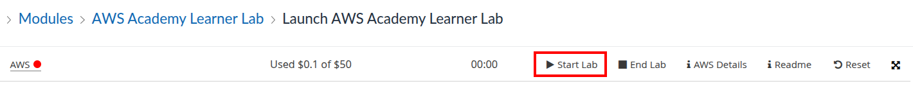
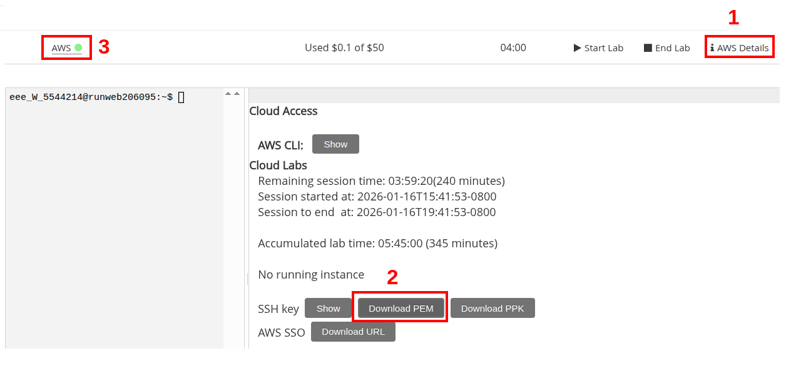

# Infrastructure Provisioning

> <https://www.redhat.com/en/topics/automation/what-is-provisioning>

**IT Infrastructure** includes the hardware, software, networks, and facilities required to develop, test, deliver, monitor, control or support IT services.

**Provisioning** is the process of creating and setting up IT infrastructure, including the steps required to manage user and system access to various resources.

- Administrators provision and maintain infrastructure, including servers, *cloud resources*, user profiles, network appliances, and service accounts.

## Practice

> Goal: Create virtual machine in the cloud and connect to it via SSH

1. Login to [AWS Academy Learner Lab](https://awsacademy.instructure.com/courses/149091/modules/items/14445074) with your student credentials.

1. Start a time-limited lab session. It'll take a while to provision a temporary AWS account.
    

1. Once the environment is ready, download the auto-generated private key (to your `workspace`), then open the web interface.
    

1. Create an EC2 instance, configured from the UI with the following properties
    - Name: `gitlab`
    - OS (AMI): `Ubuntu Server 24.04`
    - Instance Type: `t2.medium`
    - Key pair (login): `vockey` (includes the public counterpart for the private PEM downloaded earlier).
    - Firewall (security groups): allow `SSH`, `HTTP`, and `HTTPS`.
    - Storage: `16GiB`

1. Once the instance launches, take note of its automatically-assigned public IPv4 address.

1. Assign "owner-only read-only" permissions to the downloaded key file, then connect via SSH.
  
    ```bash
    sudo chmod 400 ./labsuser.pem
    ssh -i ./labsuser.pem ubuntu@<instance-ip>
    ```

## Task 1

Infrastructure as Code (IaC) enables automated provisioning of resources to ensure consistency accross different environments, accelerate development, and reduce the liklihood of human errors.

> Goal: delete the instance created in practice, then re-create it automatically from code.

1. Obtain the latest binaries for [`terraform`](https://developer.hashicorp.com/terraform/install) and [`aws`](https://docs.aws.amazon.com/cli/latest/userguide/getting-started-install.html) CLIs from script. This includes:

    1. Downloading with `curl` or `wget` and extraction (if needed).
    1. Placement in PATH-accessible directory (typically `/usr/local/bin`)
    1. Granting execute permissions (if needed).
    1. Cleaning up unnecessary files/archives (if present).

1. Configure `aws` CLI with your account credentials (using the configs provided in `AWS Details` tab shown above).

1. Create relevant `.tf` files to automatically provision the same instance from practice section.
    - Configure Terraform to print the public IPv4 of the created instance.
    - Briefly explain relevant details and provide proof of successful provisioning.
1. Expected result: a single `terraform apply` creates the machine and prints its IP address in the terminal.

## Task 1 (Alt)

> In case of problems with AWS access, or just as a bonus activity

Build and provision VM infrastructure with [Packer + Vagrant](https://developer.hashicorp.com/packer/integrations/hashicorp/vagrant)

- Create `base.pkr.hcl` to build a VM image based on Ubuntu 24.04 server with docker installed inside.

- Create `Vagrantfile` to run the infrastructure locally on VirtualBox or your native VMM (e.g., Hyper-V Mananger, Virt-Manager, or UTM).
