# SSD Lab 3: Memory Safety & Fuzz Testing

**Lab:** SSD-S26 Lab 3
**Student:** Melnikov Sergei (s.melnikov@innopolis.university)
**Sources:** [github](https://github.com/peplxx/SSD-S26)

---

## Task 1: Memory Safety

### Program 1

**Issue:** Memory allocated with `malloc(N)` — allocates only N **bytes** instead of N **integers**. No `free()` call — memory leak.

**CWE:** [CWE-401](https://cwe.mitre.org/data/definitions/401.html) — Missing Release of Memory after Effective Lifetime

**Buggy code:**
```c
int *arr = malloc(N);
// no free(arr)
```

**Fix:**
```c
int *arr = malloc(N * sizeof(int));
// ...
free(arr);
```

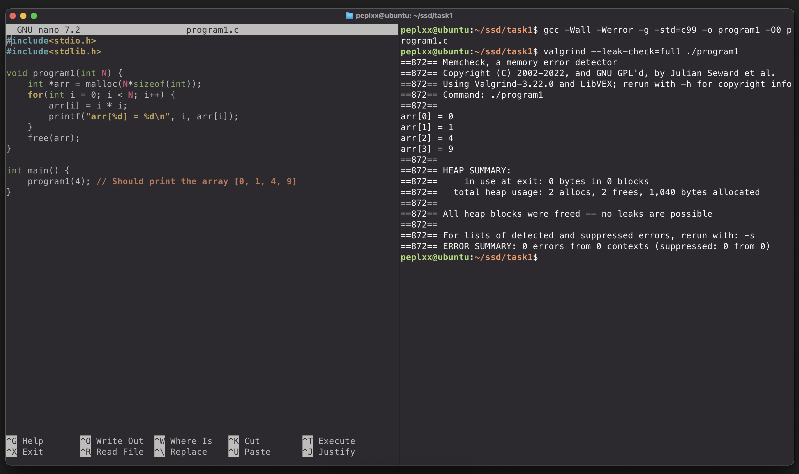

---

### Program 2

**Issue:** `arr` is freed inside `work()`, then accessed again in `program2()` after the call — use-after-free. Additionally, `memset` only zeroes first element instead of whole array.

**CWE:** [CWE-416](https://cwe.mitre.org/data/definitions/416.html) — Use After Free

**Buggy code:**
```c
void work(int* arr, unsigned N) {
    // ...
    free(arr); // freed here
}

void program2(unsigned N) {
    // ...
    work(arr, N);
    for(int i=0; i<N; i++) {
        printf("arr[%d] = %d\n", i, arr[i]); // used after free!
    }
}
```

**Fix:** Remove `free(arr)` from `work()`, free in `program2()` after use.

```c
void work(int* arr, unsigned N) {
    for(int i=1; i<N; i++) {
        arr[i] = arr[i-1] * 2;
    }
    // no free here
}

void program2(unsigned N) {
    // ...
    work(arr, N);
    for(int i=0; i<N; i++) {
        printf("arr[%d] = %d\n", i, arr[i]);
    }
    free(arr); // freed here
}
```

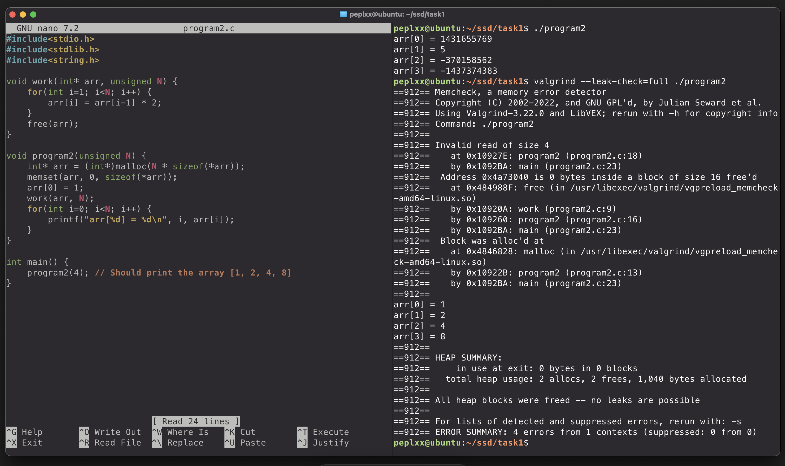
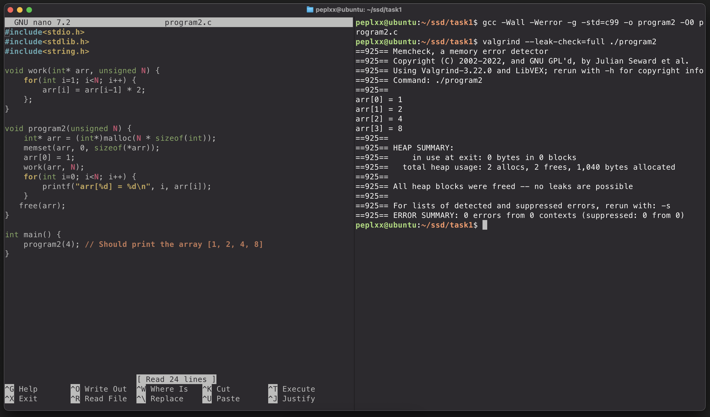

---

### Program 3

**Issue:** Assignment `=` used instead of comparison `==` in null check. `arr = NULL` overwrites the allocated pointer with NULL — always triggers the error branch and leaks memory.

**CWE:** [CWE-476](https://cwe.mitre.org/data/definitions/476.html) — NULL Pointer Dereference

**Buggy code:**
```c
if((N < 1) || (arr = NULL)) { // assignment, not comparison!
```

**Fix:**
```c
if((N < 1) || (arr == NULL)) {
```

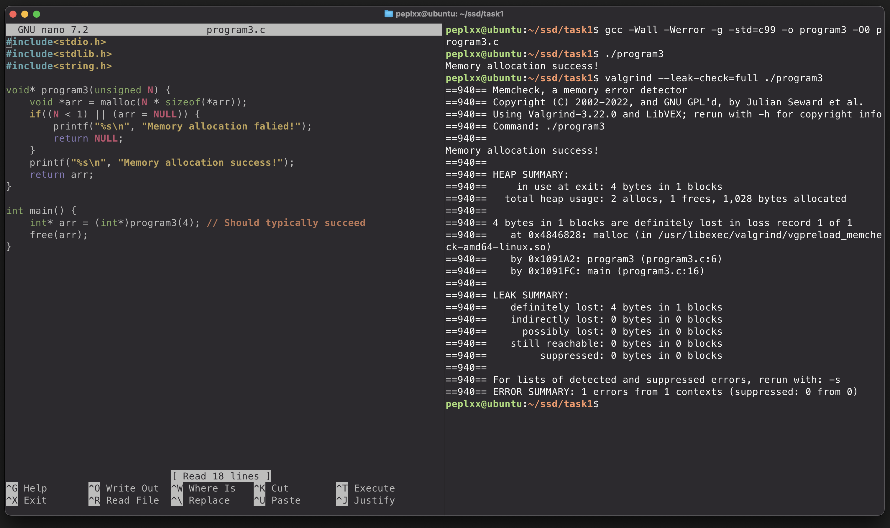
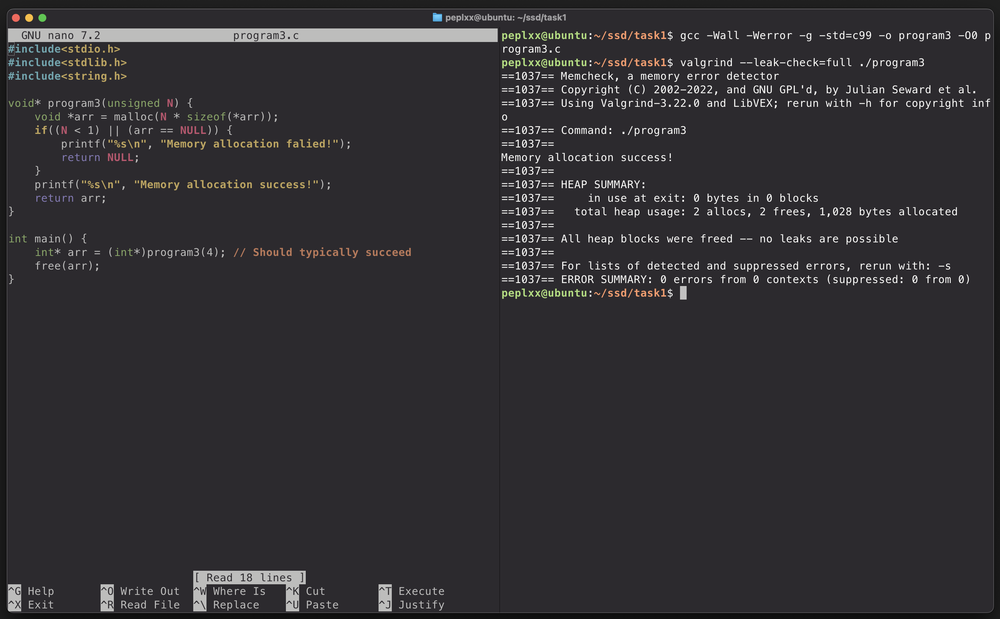

---

### Program 4

**Issue:** Returns a pointer to a stack-allocated local array. After `getString()` returns, the stack frame is destroyed — pointer becomes dangling.

**CWE:** [CWE-562](https://cwe.mitre.org/data/definitions/562.html) — Return of Stack Variable Address

**Buggy code:**
```c
char* getString() {
    char message[100] = "Hello World!"; // stack allocated
    char* ret = message;
    return ret; // dangling pointer!
}
```

**Fix:** Allocate on heap and free after use.

```c
char* getString() {
    char message[100] = "Hello World!";
    char* ret = (char*)malloc(100 * sizeof(char));
    strcpy(ret, message);
    return ret;
}

void program4() {
    char* string = getString();
    printf("String: %s\n", string);
    free(string);
}
```

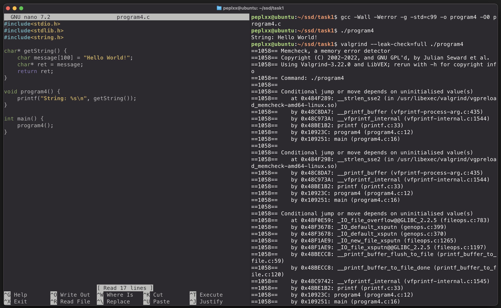
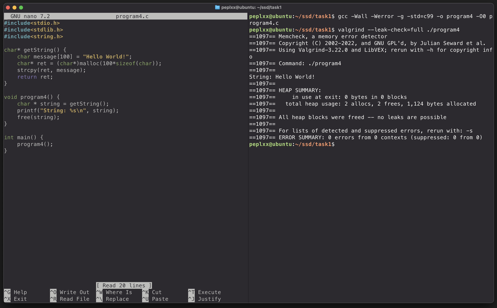

---

## Task 2: Fuzz Testing

### Setup

```bash
# Run AFL++ container
docker run --name afl -itd aflplusplus/aflplusplus
docker exec -it -w /tmp afl bash

# Install python-afl
pip install python-afl
```

### Seed Corpus

Prepared diverse inputs covering normal and edge cases:

```bash
# 1. Simple plain text
echo -n "hello" > inputs/plain.txt

# 2. Valid percent encoding
echo -n "%41%42%43" > inputs/percent_valid.txt      # ABC

# 3. Percent at end of string (triggers IndexError!)
echo -n "hello%" > inputs/percent_end.txt

# 4. Percent with one char (triggers IndexError!)
echo -n "hello%4" > inputs/percent_one.txt

# 5. Invalid hex after percent (triggers ValueError!)
echo -n "%GG" > inputs/percent_invalid_hex.txt

# 6. Empty input
echo -n "" > inputs/empty.txt

# 7. Only percent signs
echo -n "%%%" > inputs/only_percent.txt

# 8. Encoded special characters
echo -n "%20%2B%25" > inputs/encoded_special.txt    # space, +, %
```

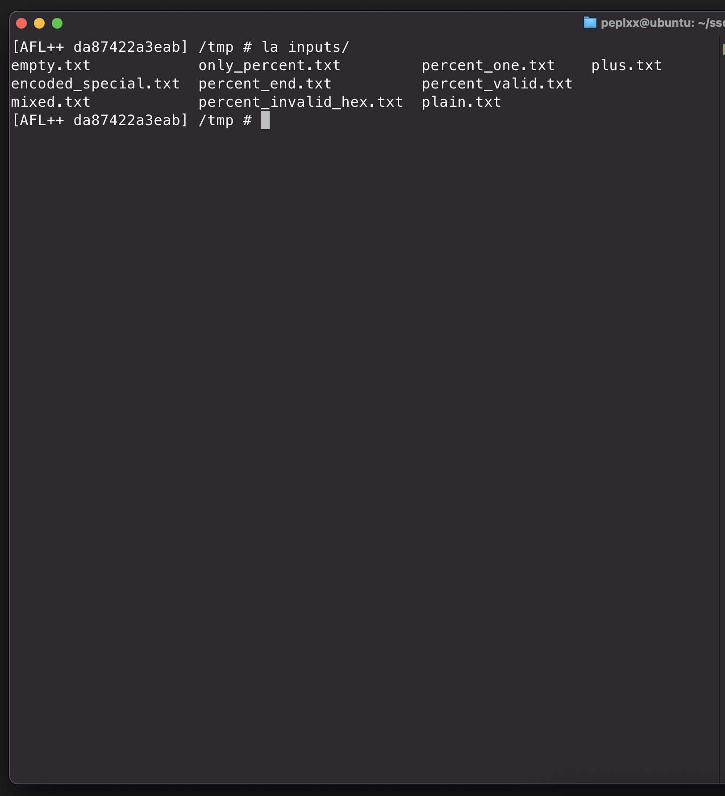

### Running the Fuzzer

```bash
py-afl-fuzz -i inputs -o output -- python uridecode.py
```

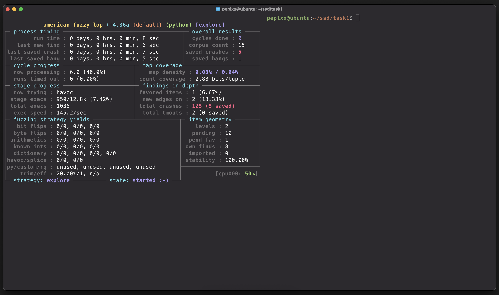

### Results

Crashes and hangs detected in `output/crashes/` and `output/hangs/`.

**fuzzer_stats:**
```
american fuzzy lop ++4.36a {default} (python) [explore]

process timing
  run time        : 0 days, 0 hrs, 0 min, 8 sec
  last new find   : 0 days, 0 hrs, 0 min, 6 sec
  last saved crash: 0 days, 0 hrs, 0 min, 7 sec
  last saved hang : 0 days, 0 hrs, 0 min, 5 sec

overall results
  cycles done   : 0
  corpus count  : 15
  saved crashes : 5
  saved hangs   : 1

stage progress
  now trying  : havoc
  stage execs : 950/12.8k (7.42%)
  total execs : 1036
  exec speed  : 145.2/sec

findings in depth
  total crashes : 125 (5 saved)
  total tmouts  : 2 (0 saved)

map coverage
  map density         : 0.03% / 0.04%
  count coverage      : 2.83 bits/tuple

item geometry
  levels    : 2
  pending   : 10
  pend fav  : 1
  own finds : 8
  imported  : 0
  stability : 100.00%
```

### Crash Analysis

**Crash inputs:**
| Input | Cause |
|-------|-------|
| `hello%` | `%` at end of string — `s[i+1]` and `s[i+2]` out of bounds → `IndexError` |
| `%GG` | Invalid hex digits after `%` → `ValueError` from `int('G', 16)` |

**CWE:** [CWE-129](https://cwe.mitre.org/data/definitions/129.html) — Improper Validation of Array Index

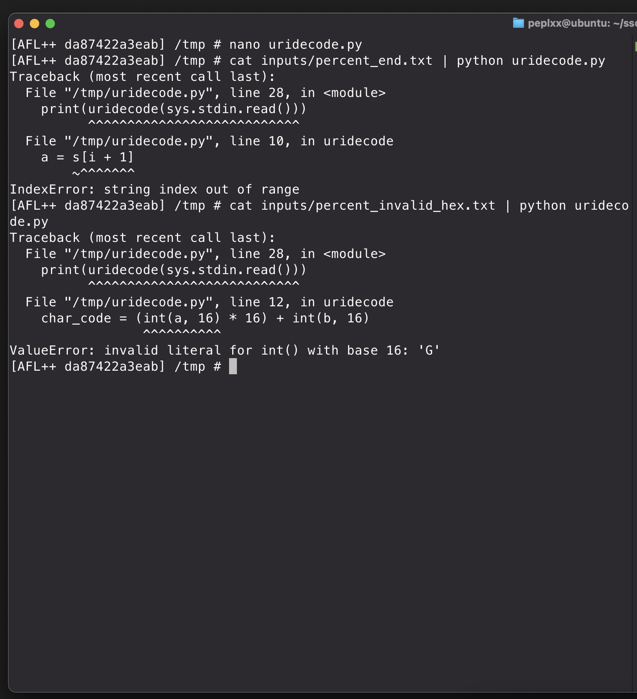

### Hang Analysis

**Hang input:** `+` alone or any input containing `+`

**Cause:** When `s[i] == '+'`, the code appends a space but **never increments `i`** → infinite loop.

### Fix

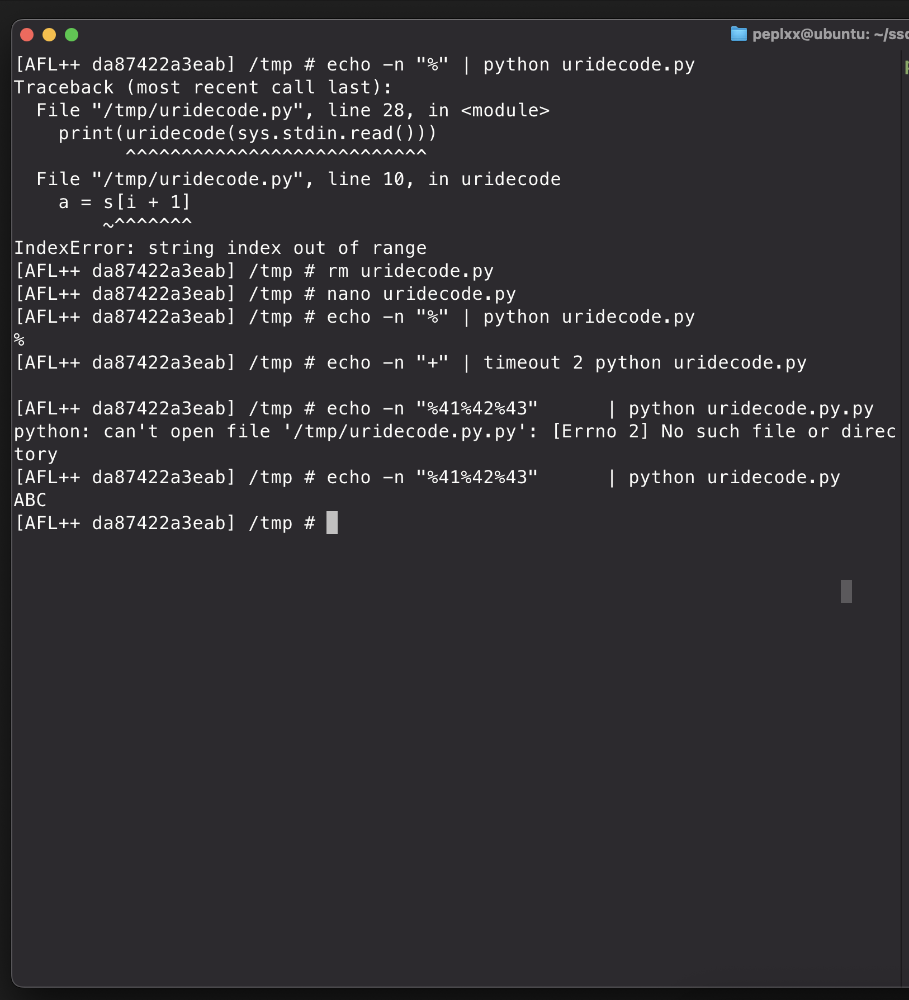

```python
HEX_CHARS = set('0123456789abcdefABCDEF')

def uridecode(s):
    ret = []
    i = 0
    while i < len(s):
        if (s[i] == '%' and
                i + 2 < len(s) and          # bounds check
                s[i + 1] in HEX_CHARS and   # valid hex digit
                s[i + 2] in HEX_CHARS):     # valid hex digit
            a = s[i + 1]
            b = s[i + 2]
            char_code = (int(a, 16) * 16) + int(b, 16)
            ret.append(chr(char_code))
            i += 3
        elif s[i] == '+':
            ret.append(' ')
            i += 1  # was missing — caused infinite loop!
        else:
            ret.append(s[i])
            i += 1
    return ''.join(ret)
```

### Questions Answers

**Will the fuzzer ever terminate?**
No. AFL++ runs indefinitely unless stopped manually or a timeout/iteration limit is set. It keeps mutating inputs as long as new coverage is discovered.

**How do coverage-guided fuzzers work? Is AFL coverage-guided?**
Coverage-guided fuzzers instrument the target binary to track which code paths each input exercises. Inputs that trigger new paths are kept as seeds for further mutation. Yes, AFL++ is coverage-guided — it uses compile-time instrumentation to track branch coverage.

**How to optimize a fuzzing campaign?**
- Provide high-quality, diverse seed corpus
- Use compile-time instrumentation (`afl-gcc-fast`) for better coverage tracking
- Enable parallel fuzzing (`-M`/`-S` flags)
- Use dictionaries with domain-specific tokens (e.g., `%`, hex chars for URI fuzzing)
- Run with AddressSanitizer to catch more memory bugs per execution


## Task 3: HashMap Security Fixes

### CWE Findings & Fixes

#### CWE-457 — Use of Uninitialized Variable + Infinite Loop (`HashIndex`)

**Original code:**
```c
int HashIndex(char* key) {
    int sum;                        // uninitialized — undefined behavior
    for (char* c = key; c; c++) {  // checks pointer, not char — never NULL → infinite loop
        sum += *c;
    }
    return sum;
}
```

**Issues:**
- `sum` is uninitialized — result is undefined
- Loop condition `c` checks pointer address (never NULL) instead of `*c != '\0'` — infinite loop
- Return type `int` used as array index — should be `unsigned int`
- No bounds check — index can exceed `MAP_MAX`

**Fix:**
```c
unsigned int HashIndex(const char* key) {
    if (key == NULL) return 0;
    unsigned int sum = 0;
    for (const char* c = key; *c != '\0'; c++) {
        sum += (unsigned char)*c;
    }
    return sum % MAP_MAX;
}
```

---

#### CWE-401 — Missing Release of Memory (`HashInit`)

**Original code:**
```c
HashMap* HashInit() {
    return malloc(sizeof(HashMap));  // data[] pointers are garbage
}
```

**Issue:** `malloc` does not zero memory — `data[]` pointers contain garbage values, leading to undefined behavior when dereferenced.

**Fix:**
```c
HashMap* HashInit() {
    return calloc(1, sizeof(HashMap));  // zeroes all data[] pointers
}
```

---

#### CWE-476 — NULL Pointer Dereference (missing NULL checks)

**Original code:**
```c
void HashAdd(HashMap *map, PairValue *value) {
    int idx = HashIndex(value->KeyName);  // no NULL check on map or value
    ...
}
```

**Issue:** All functions dereference `map` and `key`/`value` without checking for NULL — undefined behavior if NULL is passed.

**Fix:** Added NULL guards to all functions:
```c
void HashAdd(HashMap *map, PairValue *value) {
    if (map == NULL || value == NULL) return;
    ...
}

PairValue* HashFind(HashMap *map, const char* key) {
    if (map == NULL || key == NULL) return NULL;
    ...
}

void HashDelete(HashMap *map, const char* key) {
    if (map == NULL || key == NULL) return;
    ...
}

void HashDump(HashMap *map) {
    if (map == NULL) return;
    ...
}
```

---

#### CWE-134 — Uncontrolled Format String (`HashDump`)

**Original code:**
```c
printf(val->KeyName);  // KeyName used directly as format string
```

**Issue:** If `KeyName` contains format specifiers (e.g., `%s`, `%n`), attacker can read/write arbitrary memory.

**Fix:**
```c
printf("%s\n", val->KeyName);  // KeyName treated as plain string
```

---

#### CWE-20 — Improper Input Validation (`HashFind` / `HashDelete`)

**Original code:**
```c
if (strcmp(val->KeyName, key))   // strcmp returns 0 on match — 0 is FALSE in C!
    return val;                   // never returns a match
```

**Issue:** `strcmp` returns `0` when strings are equal, but `0` evaluates to `false` — matches are never detected, non-matches are returned instead.

**Fix:**
```c
if (strcmp(val->KeyName, key) == 0)  // explicit check for equality
    return val;
```

---

#### CWE-672 — Duplicate Key Causes Circular List (`HashAdd`)

**Original code:**
```c
if (map->data[idx])
    value->Next = map->data[idx]->Next;  // skips existing head
map->data[idx] = value;
```

**Issue:** When inserting the same pointer twice, `value->Next = value` creates a circular linked list — infinite loop on traversal. Also contradicts the comment *"if the value exists, increase ValueCount"* — never implemented.

**Fix:**
```c
// If key already exists, update ValueCount instead of inserting
for (PairValue* val = map->data[idx]; val != NULL; val = val->Next) {
    if (strcmp(val->KeyName, value->KeyName) == 0) {
        val->ValueCount++;
        return;
    }
}
// Key not found — insert at head
value->Next = map->data[idx];
map->data[idx] = value;
```

---

### Summary Table

| # | CWE | Name | Location |
|---|-----|------|----------|
| 1 | [CWE-457](https://cwe.mitre.org/data/definitions/457.html) | Use of Uninitialized Variable | `HashIndex` |
| 2 | [CWE-401](https://cwe.mitre.org/data/definitions/401.html) | Missing Release of Memory | `HashInit` |
| 3 | [CWE-476](https://cwe.mitre.org/data/definitions/476.html) | NULL Pointer Dereference | All functions |
| 4 | [CWE-134](https://cwe.mitre.org/data/definitions/134.html) | Uncontrolled Format String | `HashDump` |
| 5 | [CWE-20](https://cwe.mitre.org/data/definitions/20.html) | Improper Input Validation | `HashFind`, `HashDelete` |
| 6 | [CWE-672](https://cwe.mitre.org/data/definitions/672.html) | Circular Linked List via Duplicate Insert | `HashAdd` |

### Verification

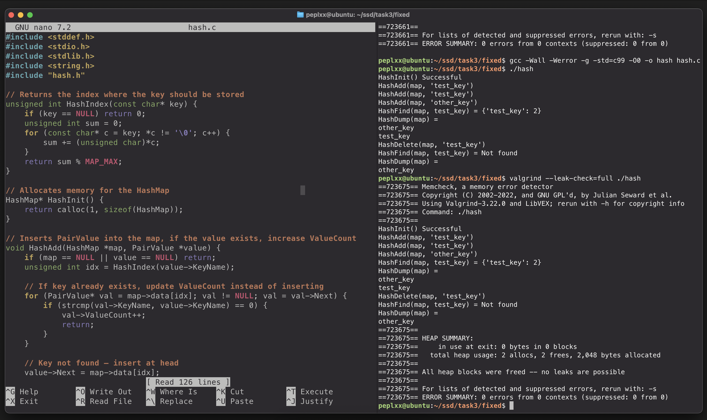

- `./hash` runs correctly: `HashFind` returns `{'test_key': 2}` after duplicate insert, `HashDelete` removes entry, post-delete `HashFind` returns `Not found`
- `valgrind` reports: **0 errors**, all heap blocks freed — no leaks possible
```
HEAP SUMMARY:
    in use at exit: 0 bytes in 0 blocks
  total heap usage: 2 allocs, 2 frees, 2,048 bytes allocated
All heap blocks were freed -- no leaks are possible
ERROR SUMMARY: 0 errors from 0 contexts
```

---

**Student:** Melnikov Sergei (s.melnikov@innopolis.university)
