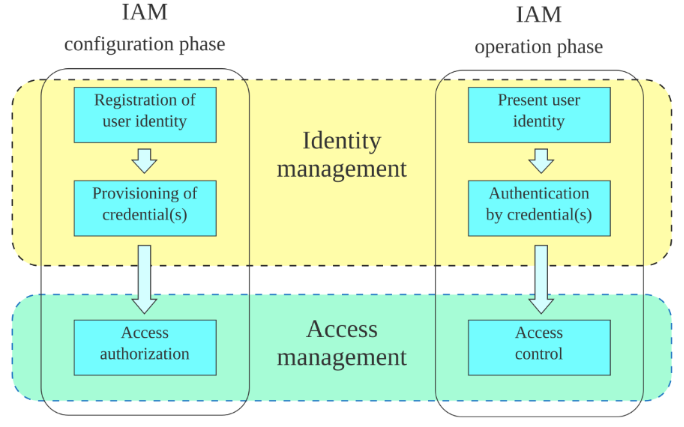

# Identity and Access Management (IAM)

> <https://en.wikipedia.org/wiki/Identity_and_access_management>

- **Identification:** user claims an identity (e.g., by specifying their username or email)
- **Authentication:** user proves their identity (e.g., with a password or access key)
- **Authorization:** user gets access to certain system resources/functionalities based on their proven identity (e.g., access to the admin portal is only available for system administrators).

Illustration

## Access Control

An **access policy** defines the set of access authorization rules (see illustration above). **Access control** involves the enforcement of such rules.

- **Popular access control models include** [DAC](https://en.wikipedia.org/wiki/Discretionary_access_control), [MAC](https://en.wikipedia.org/wiki/Mandatory_access_control), [ABAC](https://en.wikipedia.org/wiki/Attribute-based_access_control), and [RBAC](https://en.wikipedia.org/wiki/Role-based_access_control).

- **Broken Access Control** is the most common security issue in web apps (OWASP Top 10).

## Examples

- DAC is implemented in [Unix file mode](https://en.wikipedia.org/wiki/File-system_permissions), in which access is based on the identity of the user and is controlled at the discretion of the data owner.

- MAC is implemented in [AppArmor](https://apparmor.net/), in which a central authority enforces restrictions on program capabiltiies via security profiles.

- RBAC is implemented in [K8s API Access](https://kubernetes.io/docs/reference/access-authn-authz/rbac/), in which roles (e.g., `secret-reader`) are bound to individuals (e.g., `alice` and `bob`) to facilitate quick access adjustments as user roles change within the organization.

- ABAC is supported in [AWS IAM Policies](https://docs.aws.amazon.com/IAM/latest/UserGuide/introduction_attribute-based-access-control.html), in which authorization decisions can rely on dynamic attributes (tags) associated with the subject (user), object (resource), and/or the access request itself.

## Questions for Discussion

- Can the file owner in Linux do any `chmod`, what about `chown`? Any restrictions on that?

- Does AppArmor replace traditional DAC in Linux with MAC? Explain.

- In RBAC, how is the concept of roles any different from the traditional user groups?

- Give an example access scenario where ABAC is the best fit among the listed approaches.
