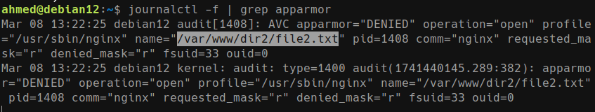

# Task 1: MAC with AppArmor

> Note: following along with these instructions requires an Ubuntu host or a VM/Cloud environment.

1. Ensure `apparmor` and `apparmor-utils` are installed, verify with `aa-status`.

1. Install `nginx` with `apt` and verify it's running with `sudo systemctl status nginx`

1. Setup a small demo for "WebApp directory confinement" with an Nginx server. The server should serve `file1.txt` and `file2.txt` from directories `dir1` and `dir2` respectively. Minimal server config is provided:

    ```nginx
    # /etc/nginx/sites-available/default
    server {
        listen 80 default_server;
        listen [::]:80 default_server;

        root /var/www;

        location /dir1/ {
            alias /var/www/dir1/;
        }

        location /dir2/ {
            alias /var/www/dir2/;
        }
    }
    ```

1. Verify that both commands work successfully

    ```bash
    curl localhost/dir1/file1.txt
    curl localhost/dir2/file2.txt
    ```

1. Generate a default profile for Nginx

    ```bash
    sudo aa-genprof nginx
    ```

1. Update the profile config at `/etc/apparmor.d/usr.sbin.nginx` to restrict the server to only serve files from `dir1`.

1. Reload AppArmor and restart nginx, then verify that the first `curl` command is allowed but the second one is blocked.

1. Show relevant AppArmor logs. Example

    
