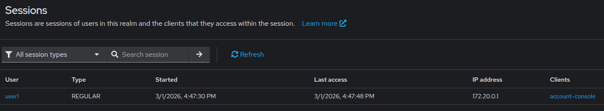
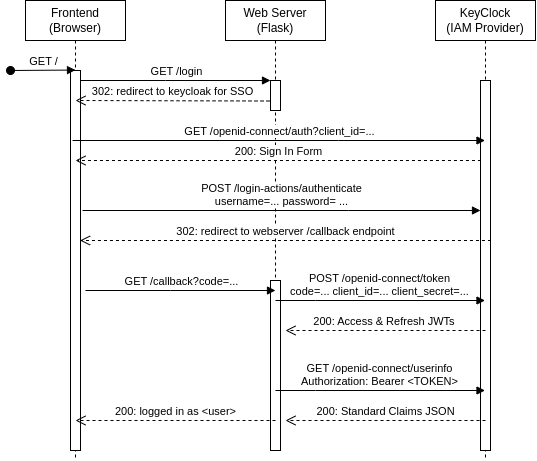

# KeyCloak

**Keycloak** is an open-source IAM solution that helps software developers "add authentication to applications and secure services with minimum effort".

- It provides a management console to handle login/registration forms, user account management, and integration with multiple 3rd-party identity providers and directory serviecs for social login and SSO.

## Practice

1. Deploy KeyCloak server with Docker Compose

    ```yaml
    services:
        keycloak:
            container_name: keycloak
            ports:
                - "9000:8080"
            environment:
                - KC_BOOTSTRAP_ADMIN_USERNAME=admin
                - KC_BOOTSTRAP_ADMIN_PASSWORD=admin
            image: quay.io/keycloak/keycloak:26.0
            volumes:
                - keycloak_data:/opt/keycloak/data
            command: start-dev
            networks:
                - lab_net
    volumes:
        keycloak_data:
    networks:
        lab_net:
            external: true
    ```

1. Access server at <http://localhost:9000> with credentials from compose file.
    1. Create a realm (like a namespace for managing objects) named `myrealm`.
    1. Create an OpenID Connect client `myapp`. Enable authentication and authorization.
    1. Configure RBAC: create a role `admin-role` under the client.
    1. Create a user `user1`: an end-user for your application.
    1. Set a credential (i.e., a password) and a role mapping: `user1` has `admin-role`.
    1. Test the login logic by signing in to the default "account console" app, then check session on the server.

    

## Task 3: SSO with KeyCloak

- Create a minimal Single-Page Application (SPA) with a login/logout button that shows user profile information of the logged-in user. Use your favourite framework and server-side language.

- `user1` already has an account in KeyCloak (created in the practice section above) and wants to use it to login to your service (among others they use).

- Refer to the sequence diagram for an overview of the process

    
