# SSD Lab 4: Identity and Access Management

**Lab:** SSD-S26 Lab 4

**Student:** Melnikov Sergei (s.melnikov@innopolis.university)

**Sources:** [github](https://github.com/peplxx/SSD-S26)

---

## Overview

This lab covers Identity and Access Management (IAM) concepts including:
- **Mandatory Access Control (MAC)** with AppArmor
- **OAuth 2.0** social login with GitHub
- **OpenID Connect (OIDC)** Single Sign-On with KeyCloak

---

## Task 1: MAC with AppArmor

### Objective

Configure AppArmor to restrict Nginx web server access — allow serving files from `dir1` but block access to `dir2`.

### Environment Setup

AppArmor requires native Linux kernel support. Used **Multipass VM** on macOS (OrbStack doesn't include AppArmor kernel modules).

``` bash
# Create Ubuntu VM with full kernel support
multipass launch 22.04 --name lab4-vm --cpus 2 --memory 2G --disk 10G
multipass shell lab4-vm

# Install required packages
sudo apt update
sudo apt install -y apparmor apparmor-utils nginx
```

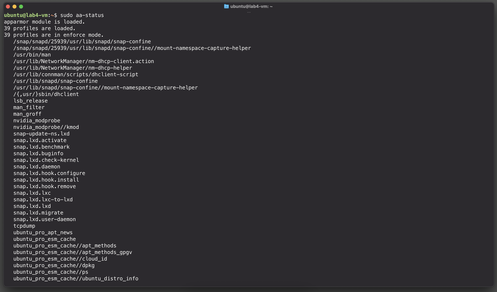

### Nginx Configuration

Created test directories and files:

``` bash
sudo mkdir -p /var/www/dir1 /var/www/dir2
echo "This is file1 from dir1" | sudo tee /var/www/dir1/file1.txt
echo "This is file2 from dir2" | sudo tee /var/www/dir2/file2.txt
sudo chown -R www-data:www-data /var/www/dir1 /var/www/dir2
```

Nginx configuration (`/etc/nginx/sites-available/default`):

``` nginx
server {
    listen 80 default_server;
    listen [::]:80 default_server;

    root /var/www;

    location /dir1/ {
        alias /var/www/dir1/;
    }

    location /dir2/ {
        alias /var/www/dir2/;
    }
}
```

### AppArmor Profile

Generated and customized profile at `/etc/apparmor.d/usr.sbin.nginx`:

``` bash
#include <tunables/global>

/usr/sbin/nginx {
  #include <abstractions/base>
  #include <abstractions/nameservice>
  #include <abstractions/openssl>
  #include <abstractions/ssl_certs>

  # Capabilities
  capability net_bind_service,
  capability setuid,
  capability setgid,
  capability dac_override,
  capability dac_read_search,
  capability chown,

  # Nginx binary and libraries
  /usr/sbin/nginx mr,
  /lib/** rm,
  /usr/lib/** rm,
  /usr/share/nginx/** r,
  /etc/ld.so.cache r,

  # Configuration files
  /etc/nginx/ r,
  /etc/nginx/** r,
  /etc/nginx/modules-enabled/ r,
  /etc/nginx/modules-enabled/** r,
  
  # System config
  /etc/ssl/** r,
  /etc/passwd r,
  /etc/group r,
  /etc/nsswitch.conf r,
  /etc/hosts r,
  /etc/resolv.conf r,

  # Nginx modules
  /usr/lib/nginx/modules/ r,
  /usr/lib/nginx/modules/** mr,

  # Runtime files
  /run/nginx.pid rw,
  /var/log/nginx/ r,
  /var/log/nginx/** rw,
  /var/lib/nginx/ r,
  /var/lib/nginx/** rw,

  # ALLOW dir1
  /var/www/ r,
  /var/www/dir1/ r,
  /var/www/dir1/** r,

  # DENY dir2
  deny /var/www/dir2/ r,
  deny /var/www/dir2/** r,

  # Proc filesystem
  @{PROC}/@{pid}/stat r,
  /proc/sys/kernel/random/boot_id r,
}
```


### Applying the Profile

``` bash
# Reload AppArmor profile
sudo apparmor_parser -r /etc/apparmor.d/usr.sbin.nginx

# Verify profile is enforced
sudo aa-status | grep nginx

# Restart nginx
sudo systemctl restart nginx
```

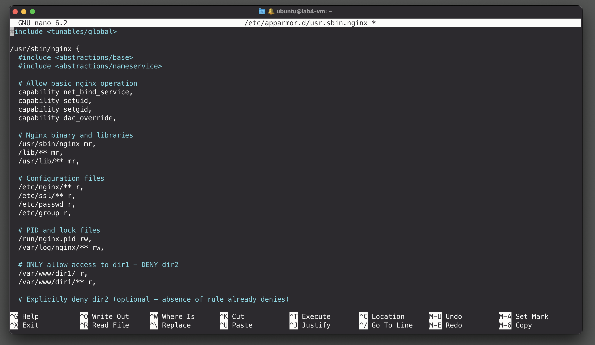

### Results

``` bash
# dir1 - ALLOWED
curl localhost/dir1/file1.txt
# Output: This is file1 from dir1

# dir2 - BLOCKED by AppArmor
curl localhost/dir2/file2.txt
# Output: 403 Forbidden
```

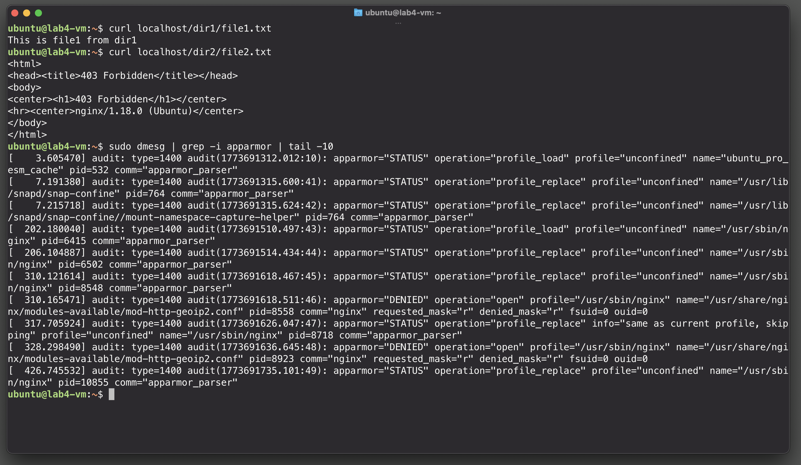

### AppArmor Logs

``` bash
sudo dmesg | grep -i apparmor | grep DENIED
```

Shows denial entries like:
``` 
apparmor="DENIED" operation="open" profile="/usr/sbin/nginx" name="/var/www/dir2/file2.txt"
```

---

## Task 2: Social Login with GitHub OAuth 2.0

### Objective

Implement social login using GitHub as the OAuth 2.0 provider.

### GitHub OAuth App Setup

1. Created OAuth App at https://github.com/settings/developers
2. **Client ID:** Obtained from GitHub
3. **Authorization callback URL:** `http://localhost:5003/authorize`

### Implementation

Flask application (`task2-oauth/app.py`):

``` python
from flask import Flask, redirect, request, session, url_for, render_template_string
import requests
import os
import json

app = Flask(__name__)
app.secret_key = os.urandom(24)

GITHUB_CLIENT_ID = os.environ.get('GITHUB_CLIENT_ID')
GITHUB_CLIENT_SECRET = os.environ.get('GITHUB_CLIENT_SECRET')

@app.route('/login')
def login():
    auth_url = (
        f"https://github.com/login/oauth/authorize"
        f"?client_id={GITHUB_CLIENT_ID}"
        f"&redirect_uri={url_for('authorize', _external=True)}"
        f"&scope=read:user"
    )
    return redirect(auth_url)

@app.route('/authorize')
def authorize():
    code = request.args.get('code')
    
    # Exchange code for access token
    resp = requests.post(
        'https://github.com/login/oauth/access_token',
        data={
            'client_id': GITHUB_CLIENT_ID,
            'client_secret': GITHUB_CLIENT_SECRET,
            'code': code,
        },
        headers={'Accept': 'application/json'}
    )
    token = resp.json().get('access_token')
    
    # Get user info
    user = requests.get(
        'https://api.github.com/user',
        headers={'Authorization': f'Bearer {token}'}
    ).json()

    session['user'] = user
    return redirect('/')
```

### OAuth 2.0 Flow Sequence Diagram

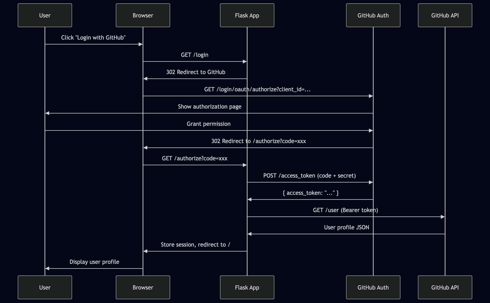

### Result

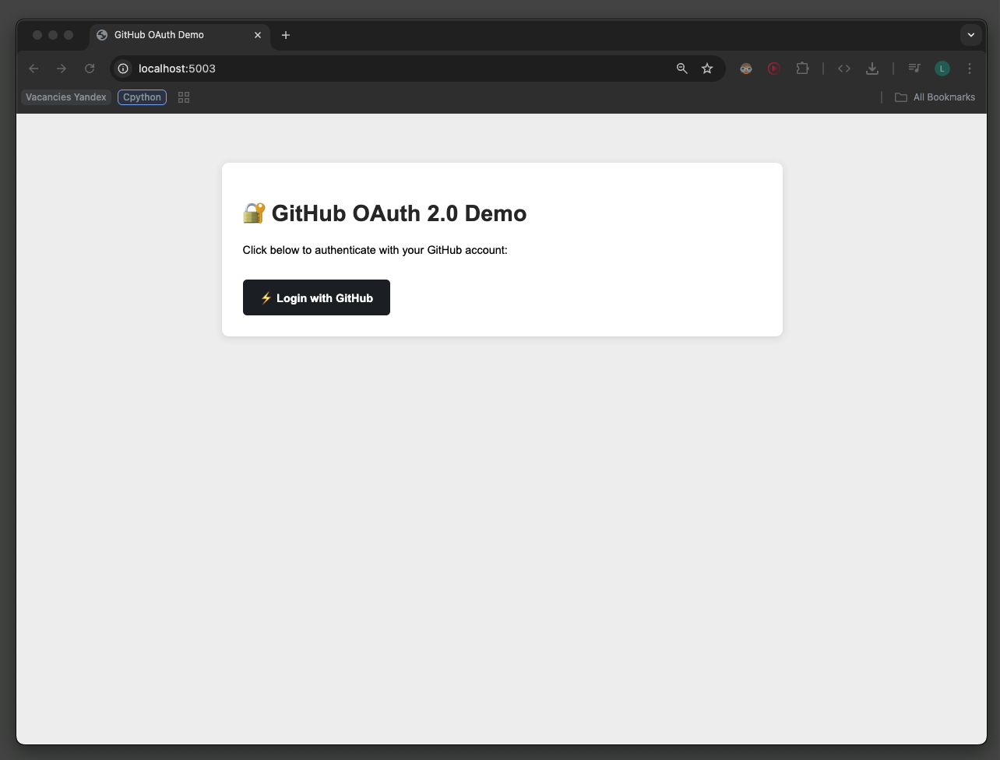
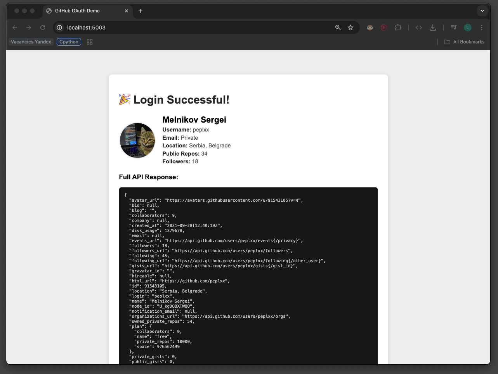

---

## Task 3: SSO with KeyCloak

### Objective

Implement Single Sign-On using KeyCloak as the OpenID Connect identity provider.

### KeyCloak Setup

Deployed KeyCloak with Docker Compose:

``` yaml
services:
  keycloak:
    container_name: keycloak
    ports:
      - "9000:8080"
    environment:
      - KC_BOOTSTRAP_ADMIN_USERNAME=admin
      - KC_BOOTSTRAP_ADMIN_PASSWORD=admin
    image: quay.io/keycloak/keycloak:26.0
    volumes:
      - keycloak_data:/opt/keycloak/data
    command: start-dev

volumes:
  keycloak_data:
```

### KeyCloak Configuration

1. **Created Realm:** `myrealm`
2. **Created Client:** `myapp` with OpenID Connect
   - Client authentication: ON
   - Valid redirect URIs: `http://localhost:5004/*`
3. **Created Role:** `admin-role` under client `myapp`
4. **Created User:** `user1` with password `password123`
5. **Assigned Role:** `user1` → `admin-role`

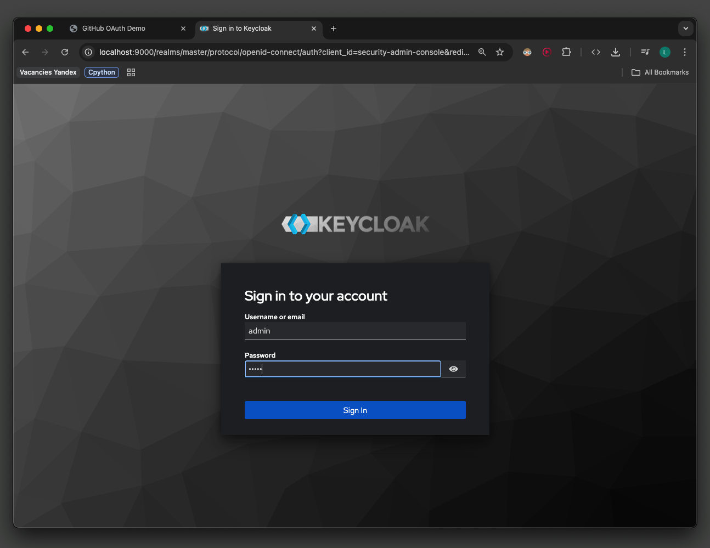

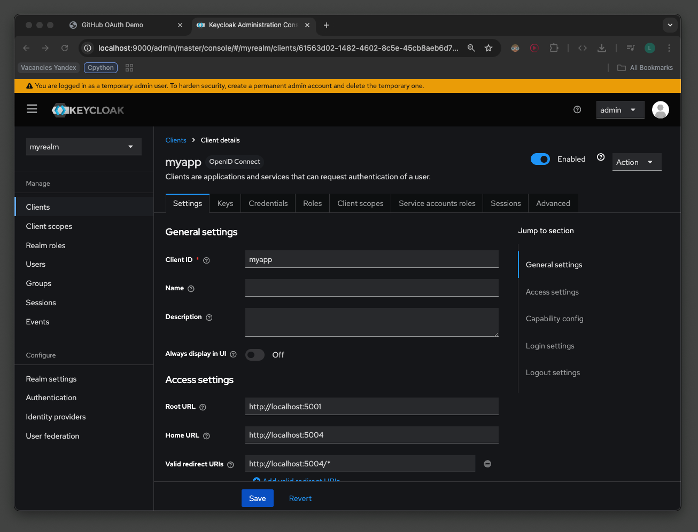

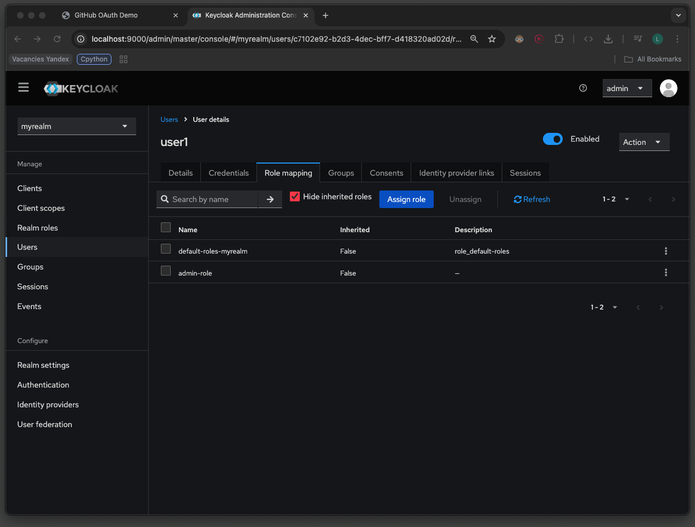

### Implementation

Flask SSO application (`task3-keycloak/app.py`):

``` python
from flask import Flask, redirect, request, session, url_for, render_template_string
import requests
import jwt
import json
import os

app = Flask(__name__)
app.secret_key = os.urandom(24)

KEYCLOAK_URL = "http://localhost:9000"
REALM = "myrealm"
CLIENT_ID = "myapp"
CLIENT_SECRET = os.environ.get('KEYCLOAK_SECRET')

AUTH_URL = f"{KEYCLOAK_URL}/realms/{REALM}/protocol/openid-connect/auth"
TOKEN_URL = f"{KEYCLOAK_URL}/realms/{REALM}/protocol/openid-connect/token"
USERINFO_URL = f"{KEYCLOAK_URL}/realms/{REALM}/protocol/openid-connect/userinfo"

@app.route('/login')
def login():
    auth_url = (
        f"{AUTH_URL}"
        f"?client_id={CLIENT_ID}"
        f"&response_type=code"
        f"&scope=openid profile email"
        f"&redirect_uri={url_for('callback', _external=True)}"
    )
    return redirect(auth_url)

@app.route('/callback')
def callback():
    code = request.args.get('code')

    # Exchange code for tokens
    resp = requests.post(TOKEN_URL, data={
        'grant_type': 'authorization_code',
        'client_id': CLIENT_ID,
        'client_secret': CLIENT_SECRET,
        'code': code,
        'redirect_uri': url_for('callback', _external=True)
    })

    tokens = resp.json()
    access_token = tokens['access_token']

    # Decode token for display
    decoded = jwt.decode(access_token, options={"verify_signature": False})
    
    # Get user info
    user = requests.get(USERINFO_URL, headers={
        'Authorization': f'Bearer {access_token}'
    }).json()

    # Extract roles from token
    roles = []
    if 'resource_access' in decoded and CLIENT_ID in decoded['resource_access']:
        roles = decoded['resource_access'][CLIENT_ID].get('roles', [])

    session['user'] = user
    session['roles'] = roles
    session['token_data'] = json.dumps(decoded, indent=2)
    return redirect('/')
```

### OIDC Flow Sequence Diagram

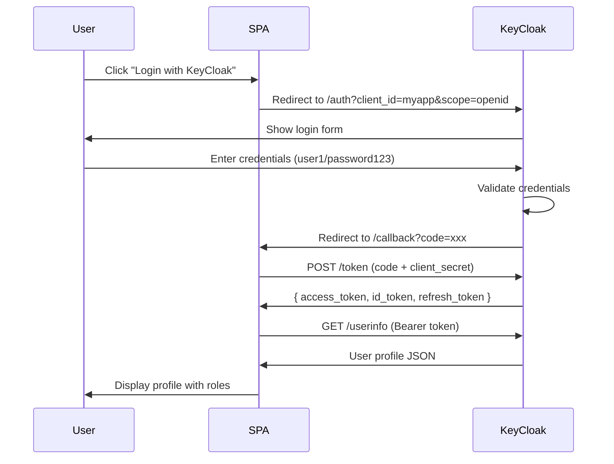

### Results

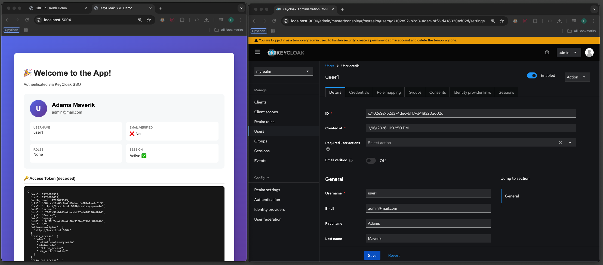

### SSO Verification

After logging into the SPA at `http://localhost:5004`, accessing KeyCloak Account Console at `http://localhost:9000/realms/myrealm/account` shows the user as **already authenticated** — no password prompt required. This confirms Single Sign-On is working correctly.

---

## Discussion Questions

### From 00.md - Access Control

**Q: Can the file owner in Linux do any `chmod`, what about `chown`? Any restrictions?**

A: File owners can `chmod` their files freely. However, only `root` can `chown` — regular users cannot change file ownership, even for files they own. This prevents users from "giving away" files to bypass quota limits.

**Q: Does AppArmor replace traditional DAC in Linux with MAC?**

A: No, AppArmor **supplements** DAC, not replaces it. Both are checked: DAC permissions are evaluated first, then AppArmor profiles. A request must pass both to succeed. AppArmor adds an additional mandatory layer that even root-owned processes must obey.

**Q: In RBAC, how are roles different from traditional user groups?**

A: Roles are **permission-centric** (define what actions are allowed), while groups are **user-centric** (collection of users). Roles can be hierarchical (admin inherits user permissions), support separation of duties, and are typically assigned per-session rather than permanently.

**Q: Example access scenario where ABAC is the best fit?**

A: Healthcare system where access depends on multiple attributes: doctor can access patient records only if (1) patient is assigned to them, (2) during working hours, (3) from hospital network, (4) for patients in their department. ABAC handles these dynamic, context-dependent rules naturally.

### From 02.md - Session Management

**Q: When to prefer stateful sessions vs JWTs?**

| Use Stateful Sessions | Use JWTs |
|----------------------|----------|
| Traditional web apps with server rendering | SPAs, mobile apps, microservices |
| Need immediate session revocation | Distributed systems without shared state |
| Sensitive applications (banking) | Stateless API authentication |

**Q: Security considerations for each?**

| Stateful Sessions | JWTs |
|------------------|------|
| ✅ Easy revocation (delete from server) | ❌ Cannot revoke until expiry |
| ✅ Protected from XSS (HttpOnly cookie) | ❌ Vulnerable if stored in localStorage |
| ❌ Requires session storage (Redis/DB) | ✅ No server-side storage needed |
| ❌ CSRF vulnerable (cookie-based) | ✅ CSRF immune (Authorization header) |

---

## Summary

| Task | Technology | Result |
|------|------------|--------|
| Task 1 | AppArmor MAC | ✅ Successfully restricted Nginx to serve only from `dir1` |
| Task 2 | GitHub OAuth 2.0 | ✅ Implemented social login with user profile display |
| Task 3 | KeyCloak OIDC | ✅ Implemented SSO with role-based access |

### Key Learnings

1. **MAC vs DAC:** AppArmor provides mandatory restrictions that apply regardless of user privileges, complementing traditional Unix permissions.

2. **OAuth 2.0 Flow:** Authorization code grant involves redirect to provider → user consent → code exchange → token retrieval → API access.

3. **OIDC extends OAuth:** Adds ID tokens (JWT) for authentication and standardized user info endpoints, enabling true Single Sign-On across applications.

---

**Student:** Melnikov Sergei (s.melnikov@innopolis.university)
