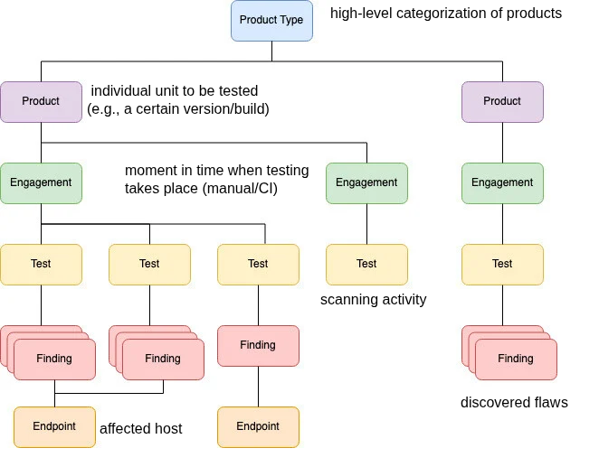

# Vulnerability Management

> <https://en.wikipedia.org/wiki/Vulnerability_management>

Vulnerability Management is a cyclical practice involving four stages:

- **Identification**: discovring vulnerabilities via manual/automatic security testing
- **Evaluation**: classifying the finding and assigning relevant labels on severity and priority
- **Addressing**: mitigating/remediating the findings (e.g., applying a software patch).
- **Reporting**: documenting actions taken (e.g., changelog).

In practice, a scanning pipeline may include (some of) the following steps:

1. Run automated security scanning tools against the source code (e.g., SAST, DAST, SCA, Secret Detection, etc).
2. Aggregate and evaluate reports from such tools (e.g., filter and deduplicate findings)
3. Automatically upload results to a vulnerability management solution (e.g., [DefectDojo](https://github.com/DefectDojo/django-DefectDojo/tree/master), [Faraday](https://github.com/infobyte/faraday), [ArcherySec](https://github.com/archerysec/archerysec))
4. Set relevant tags: finding severity, remediation priority, software version, assignee, etc.

## DefectDojo

A popular open-source vulnerability management solution written in Python. It provides:

- A centralized dashboard for inspecting security findings, with automatic deduplication.
- [Integrations](https://defectdojo.com/integrations) with 150+ scanners and security tools, and bi-directional integration with JIRA.
- [REST API](https://demo.defectdojo.org/api/v2/oa3/swagger-ui/) for automation (e.g., importing scans from CI/CD).
- "Data Classes" for logical separation of findings accross projects

> 

> 
Data Classes

> 
> 

