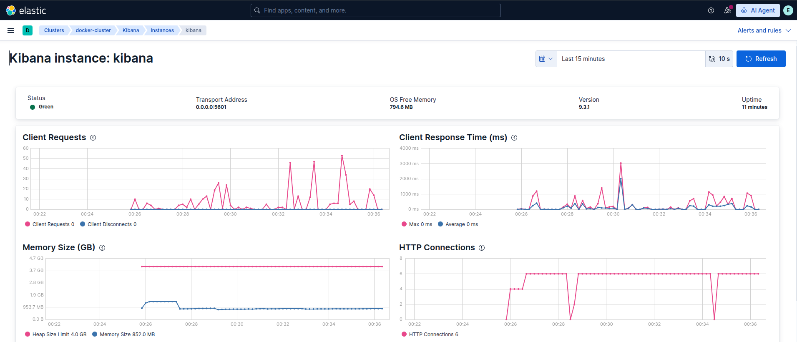

# Practice

> Refer to the README at <https://github.com/deviantony/docker-elk>

1. Deploy Minimal ELK Stack with compose.

    ```bash
    git clone https://github.com/deviantony/docker-elk
    cd docker-elk
    docker compose up setup
    docker compose up kibana-genkeys # copy keys to kibana/kibana.yaml
    docker compose up -d
    ```

1. Access Kibana on port 5601. Login with `elastic:changeme`

1. Verify server health from self-monitoring endpoint at `/app/monitoring`

    

## Task 2

- Setup **two** different integrations with systems of your choice. Recommended options: CISA KEV, IpTables, OSquery, Docker, Apache HTTP Server, Nginx, or PostgreSQL.

- Expected result: showing the executions of a sample KQL query of the ingested data, with a dashboard panel to visualize the query results.
