# SSD Lab 5: Vulnerability Management & Observability

**Lab:** SSD-S26 Lab 5

**Student:** Melnikov Sergei (s.melnikov@innopolis.university)

**Sources:** [github](https://github.com/peplxx/SSD-S26)

---

## Overview

This lab covers two core DevSecOps practices:

- **Vulnerability Management** — automated SAST scanning of three vulnerable-by-design projects, centralised finding management with DefectDojo, and report generation.
- **Observability** — deploying an ELK stack and setting up two log-shipping integrations with Kibana dashboards.

---

## Task 1: SAST Scanning + DefectDojo

### Objective

Run three SAST tools against three vulnerable projects, produce SARIF reports, automatically import them to DefectDojo via its REST API, and generate a PDF findings report.

### Environment Setup

**Deploy DefectDojo:**

``` bash
git clone --depth 1 https://github.com/DefectDojo/django-DefectDojo
cd django-DefectDojo
docker compose build && docker compose up -d
docker compose logs -f initializer | grep "Admin password:"
# Access: http://localhost:8080
```

**Clone vulnerable-by-design projects:**

``` bash
# vulpy – Flask (Python) web app with SQLite
git clone https://github.com/fportantier/vulpy && rm -rf vulpy/.git

# dvna – Express (NodeJS) web app with MySQL
git clone https://github.com/appsecco/dvna && rm -rf dvna/.git

# dvca – Damn Vulnerable C Program (image processing utilities)
git clone https://github.com/hardik05/Damn_Vulnerable_C_Program
mv Damn_Vulnerable_C_Program dvca && rm -rf dvca/.git
```

**Install SAST tools:**
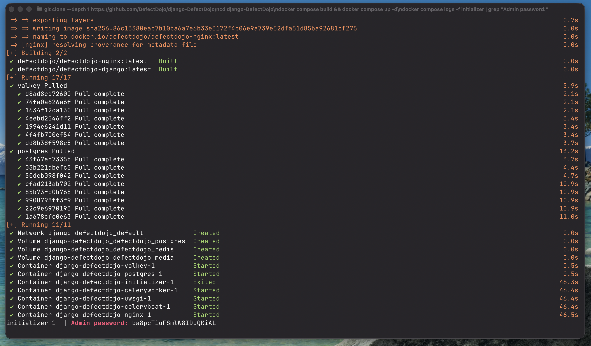

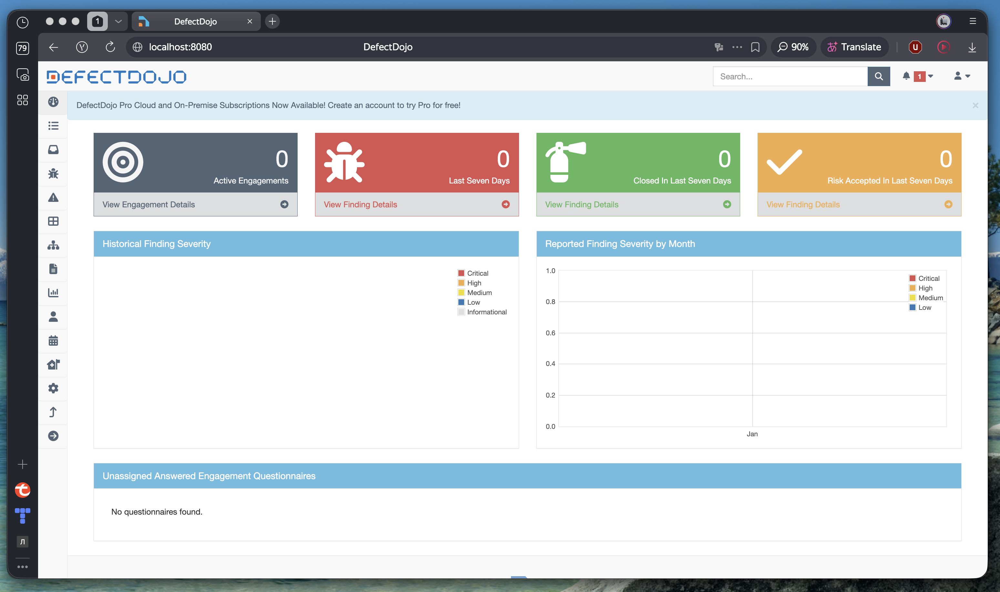

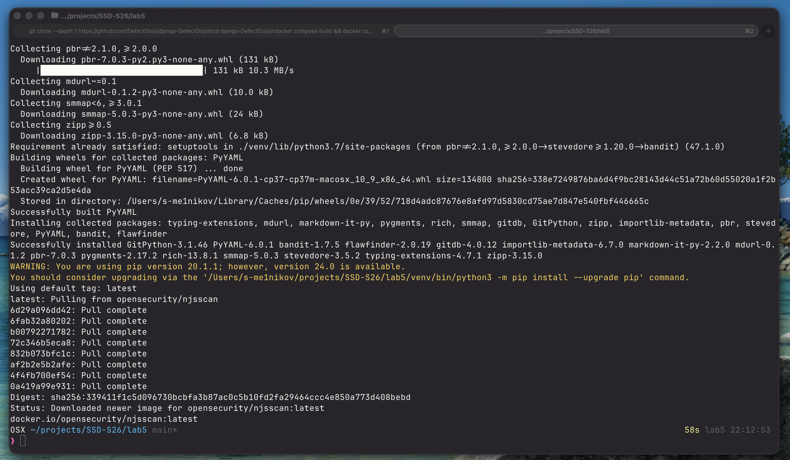

``` bash
python3 -m venv venv && source venv/bin/activate
pip install bandit bandit-sarif-formatter flawfinder
# bandit-sarif-formatter registers itself as a Bandit plugin, enabling -f sarif

# njsscan requires semgrep==1.86.0 which is not published to PyPI (versions stop at 1.46.0)
# Use the official Docker image which bundles the correct semgrep version:
docker pull opensecurity/njsscan
```

### Scanning

Each tool is matched to the project language it supports:

| Tool       | Language | Target  | Output                          |
|------------|----------|---------|---------------------------------|
| Bandit     | Python   | vulpy   | `reports/bandit_vulpy.sarif`    |
| njsscan    | NodeJS   | dvna    | `reports/njsscan_dvna.sarif`    |
| FlawFinder | C/C++    | dvca    | `reports/flawfinder_dvca.sarif` |

``` bash
# Bandit – Python SAST
bandit -r vulpy/ -f sarif -o reports/bandit_vulpy.sarif --exit-zero

# njsscan – NodeJS SAST (via Docker)
docker run --rm \
  -v "$(pwd)/dvna:/src" \
  -v "$(pwd)/reports:/reports" \
  opensecurity/njsscan --sarif -o /reports/njsscan_dvna.sarif /src || true

# FlawFinder – C/C++ SAST
flawfinder --sarif dvca/ > reports/flawfinder_dvca.sarif
```

**Findings summary:**

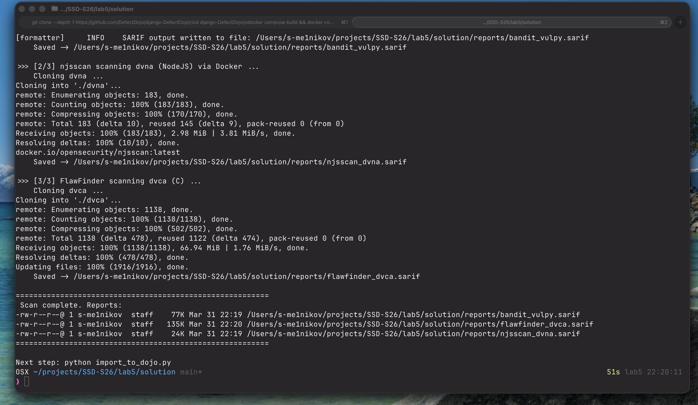

| Tool       | Project | LoC   | Findings | High | Medium | Low |
|------------|---------|-------|----------|------|--------|-----|
| Bandit     | vulpy   | 1,556 | 49       | 4    | 36     | 9   |
| njsscan    | dvna    | —     | 18       | —    | —      | —   |
| FlawFinder | dvca    | —     | 134      | —    | —      | —   |
| **Total**  |         |       | **201**  |      |        |     |

**Bandit rules triggered on vulpy:**

| Rule  | Name                              | Description                              |
|-------|-----------------------------------|------------------------------------------|
| B105  | hardcoded_password_string         | Hard-coded password value in source      |
| B108  | hardcoded_tmp_directory           | Use of `/tmp` path                       |
| B110  | try_except_pass                   | Empty `except` silently suppresses errors|
| B113  | request_without_timeout           | HTTP request with no timeout             |
| B201  | flask_debug_true                  | Flask running with `debug=True`          |
| B608  | hardcoded_sql_expressions         | SQL injection via string formatting      |

**njsscan rules triggered on dvna (selected):**

| Rule                  | CWE      | Description                                       |
|-----------------------|----------|---------------------------------------------------|
| sequelize_tls         | CWE-319  | Sequelize DB connection without TLS               |
| express_open_redirect | CWE-601  | Unvalidated redirect via `res.redirect(req.query.url)` |
| node_deserialize      | CWE-502  | Unsafe deserialization                            |
| cookie_session_no_secure | CWE-614 | Session cookie missing `Secure` flag             |
| ejs_ect_template      | CWE-79   | XSS via EJS template rendering                   |

### Importing to DefectDojo

Script `solution/import_to_dojo.py` authenticates via `/api/v2/api-token-auth/`, then calls `/api/v2/import-scan/` for each SARIF file with `auto_create_context=True` and `product_type_name="Research and Development"` so that Products and Engagements are created automatically.

``` bash
python import_to_dojo.py \
  --url http://localhost:8080 \
  --user admin \
  --password <password>
```

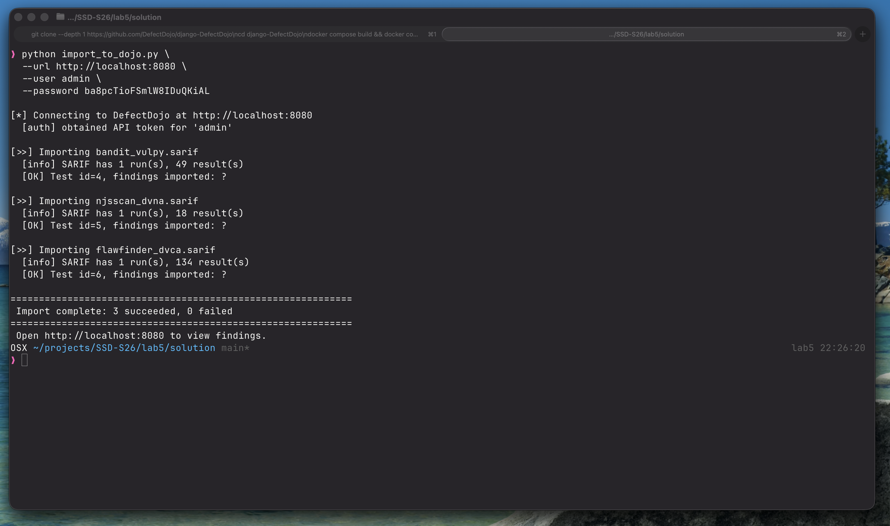

**Output:**

```
[*] Connecting to DefectDojo at http://localhost:8080
  [auth] obtained API token for 'admin'

[>>] Importing bandit_vulpy.sarif
  [info] SARIF has 1 run(s), 49 result(s)
  [OK] Test id=1, findings imported: 49

[>>] Importing njsscan_dvna.sarif
  [info] SARIF has 1 run(s), 18 result(s)
  [OK] Test id=2, findings imported: 18

[>>] Importing flawfinder_dvca.sarif
  [info] SARIF has 1 run(s), 134 result(s)
  [OK] Test id=3, findings imported: 134

 Import complete: 3 succeeded, 0 failed
```

### Results

**Products list — vulpy, dvna, dvca auto-created by the import script:**


**Findings list — severity breakdown across all findings:**


**Single finding detail — Express Open Redirect (njsscan, dvna):**

| Field       | Value                                                                 |
|-------------|-----------------------------------------------------------------------|
| Rule ID     | `express_open_redirect`                                               |
| Severity    | High                                                                  |
| CWE         | CWE-601: URL Redirection to Untrusted Site                           |
| File / Line | `app/routes/app.js` line 188                                          |
| Code        | `res.redirect(req.query.url)`                                         |
| Description | Untrusted user input in `redirect()` allows phishing via open redirect |
| Remediation | Validate and whitelist redirect targets; never redirect to raw user input |

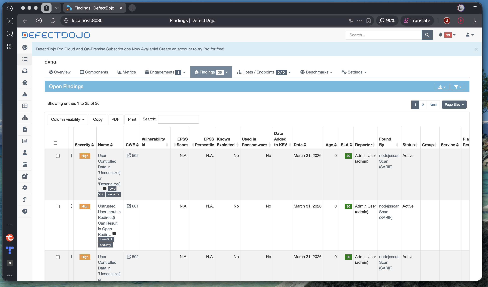

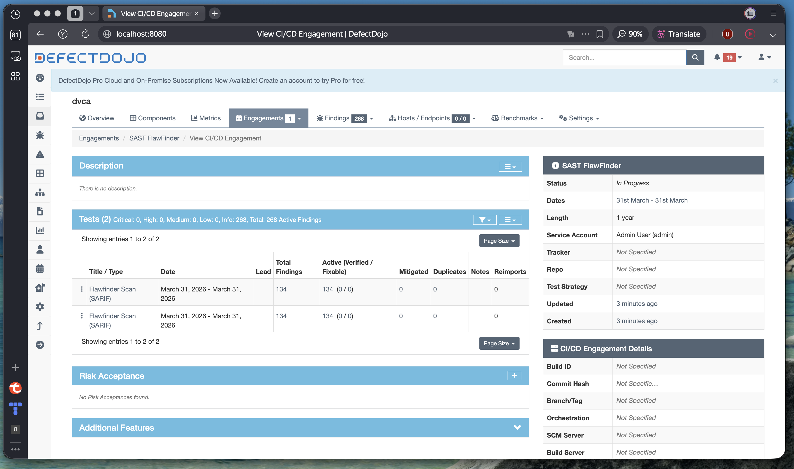


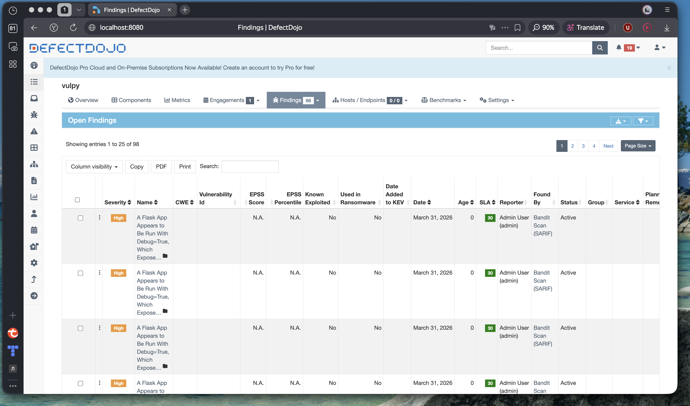

---

## Task 2: ELK Stack with Two Integrations

### Objective

Deploy a minimal ELK stack and set up two log-shipping integrations. Show KQL queries and a dashboard for each.

### Stack Deployment

Deployed with a custom `docker-compose.yml`: Elasticsearch 8.12.2, Kibana 8.12.2, Filebeat 8.12.2, and an Nginx demo container.

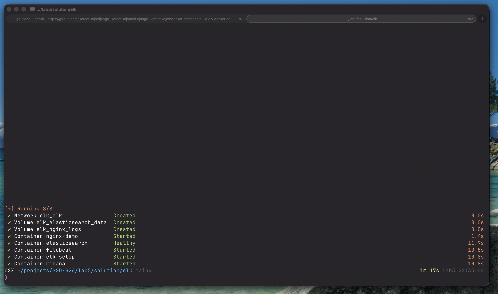

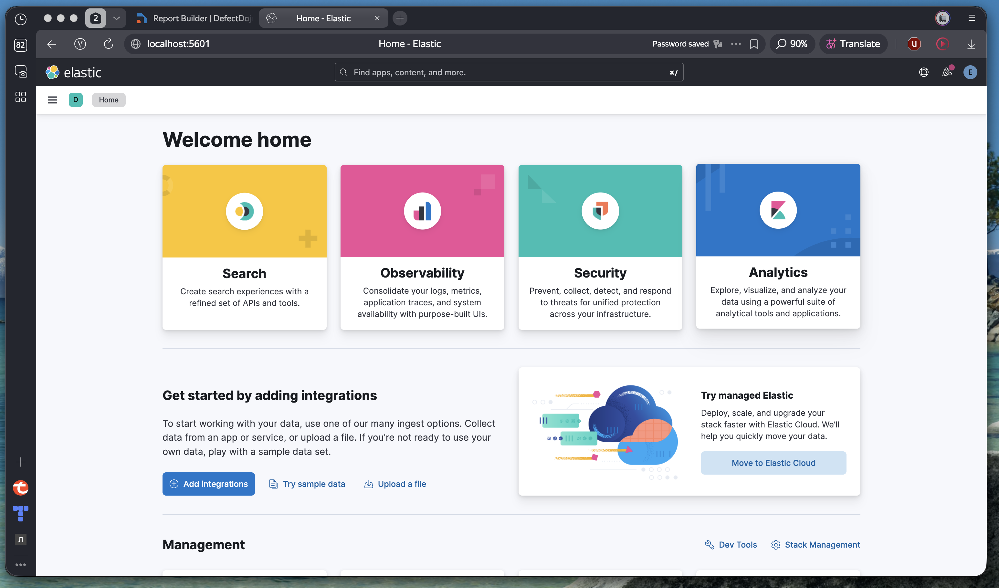

``` bash
cd lab5/solution/elk
docker compose up setup     # sets kibana_system password in Elasticsearch
docker compose up -d        # starts all services
```

Verified the cluster:

``` bash
curl -s -u elastic:changeme http://localhost:9200/_cluster/health
# "status": "yellow"  ← expected for a single-node cluster

curl -s -u elastic:changeme http://localhost:9200/_cat/indices/filebeat-*
# yellow open .ds-filebeat-2026.03.31-... 1 1 6097 0 4.3mb
```

Access Kibana at `http://localhost:5601` (elastic / changeme). Cluster health visible at `/app/monitoring`.


### Integration 1 – Nginx Access & Error Logs

An Nginx container serves HTTP on port 8081 and writes access/error logs to a shared Docker volume. Filebeat reads `/var/log/nginx/*.log` via a `log` input and tags events with `event.module: nginx`.

**Traffic generation:**

``` bash
./generate_traffic.sh http://localhost:8081 200
# Sends 200 requests — mix of 200 OK (/), 404 Not Found (/missing, /admin)
```

**KQL query — all Nginx log events:**

``` kql
event.module: "nginx"
```

**KQL query — 404 errors only:**

``` kql
tags: "nginx" AND message: *404*
```


### Integration 2 – Docker Container Logs

Filebeat's Docker autodiscover provider connects to `/var/run/docker.sock`, discovers all running containers, and reads their logs from `/var/lib/docker/containers/<id>/*.log`. Events are enriched with `container.name` and tagged with `event.module: docker`.

**KQL query — logs from all ELK containers:**

``` kql
event.module: "docker"
```

**KQL query — logs from a specific container:**

``` kql
event.module: "docker" AND container.name: "elasticsearch"
```

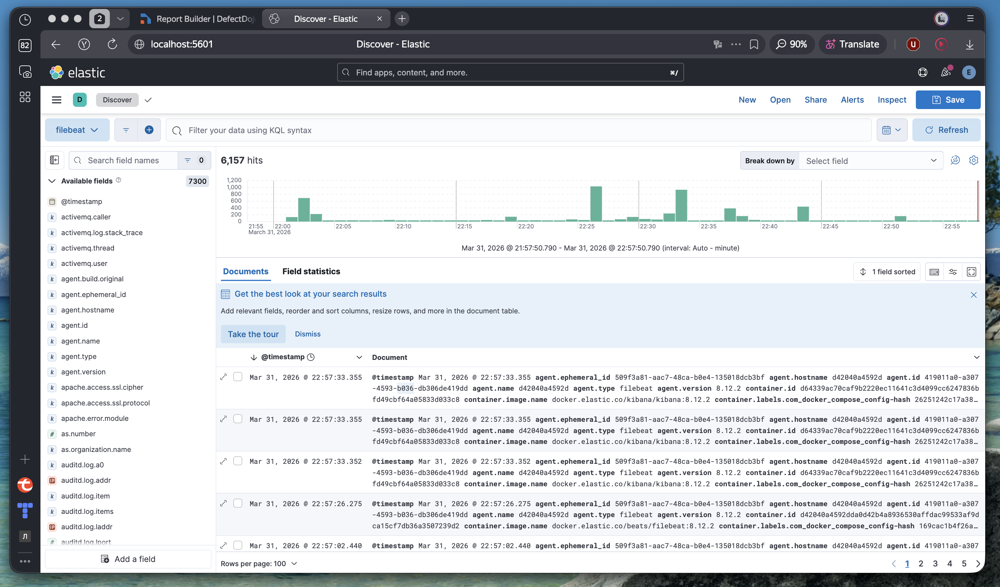

### Dashboard

Created dashboard **"Lab 5 — Observability"** with two panels:

| Panel | Type | Integration | Filter |
|-------|------|-------------|--------|
| Nginx – Requests Over Time | Area chart | Nginx | `event.module: "nginx"` |
| Docker – Log Volume by Container | Stacked bar | Docker | `event.module: "docker"` |

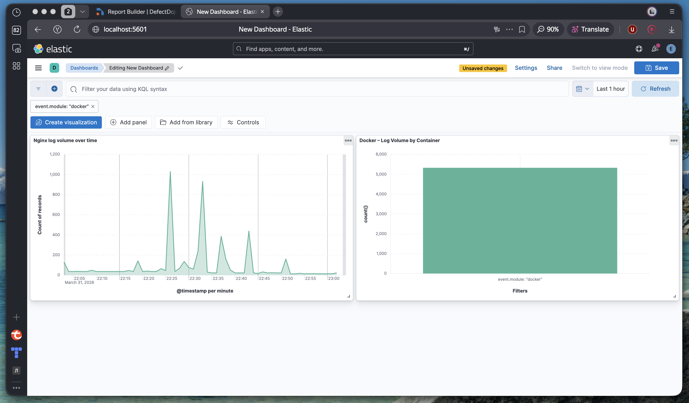

---

## Discussion Questions

### From 00.md – Vulnerability Management

**Q: What are the four stages of Vulnerability Management?**

A: **Identification** (discover via SAST/DAST/SCA) → **Evaluation** (classify by severity/priority) → **Addressing** (patch/mitigate) → **Reporting** (document actions taken, e.g. changelog). DefectDojo supports all four stages: it aggregates scanner results, lets teams triage and prioritise findings, tracks remediation status, and generates reports.

**Q: What is the difference between SAST, DAST, and SCA?**

A: **SAST** (Static Application Security Testing) analyses source code without running the application — catches insecure patterns like SQL injection strings or hard-coded secrets. **DAST** (Dynamic Application Security Testing) tests a running application by sending malicious inputs — finds runtime vulnerabilities like XSS or auth bypasses. **SCA** (Software Composition Analysis) scans dependencies for known CVEs — catches vulnerable third-party libraries.

### From 02.md – Observability

**Q: What is the difference between "push" and "pull" models for data collection? Which mode is used by Prometheus vs. OpenTelemetry?**

A: In the **pull** model the monitoring server scrapes targets on a schedule (Prometheus pulls metrics from `/metrics` endpoints). In the **push** model agents send data to a collector (OpenTelemetry exporters push spans/metrics to an OTLP endpoint). Pull is simpler for infrastructure monitoring; push works better for ephemeral workloads and cross-network boundaries.

**Q: Which type of database is suitable for metrics? What about logs?**

A: Metrics are time-series data — best stored in a **time-series database** (Prometheus TSDB, InfluxDB) which is optimised for range queries and downsampling. Logs are unstructured text — best stored in a **full-text search engine** (Elasticsearch, Loki) which supports inverted indexes and regex queries over arbitrary fields.

**Q: Should one visualise all data collected from monitoring targets? Why/why not?**

A: No. Displaying everything creates noise that hides real alerts and slows dashboards. Best practice is to pre-filter by relevance: only surface metrics that cross a threshold, aggregate high-cardinality data, and keep raw logs searchable on-demand rather than always visible.

**Q: Do many observability tools improve or impair security?**

A: Too many tools can **impair** security through tool sprawl — each tool is an additional attack surface, requires credentials to manage, and may ingest sensitive data (logs containing PII or secrets). Fewer, well-integrated tools reduce the attack surface, simplify access control, and lower the operational burden on security teams.

---

## Summary

| Task | Technology | Result |
|------|------------|--------|
| Task 1 – SAST scanning | Bandit, njsscan, FlawFinder → SARIF |  201 findings across 3 projects |
| Task 1 – Vulnerability management | DefectDojo REST API import |  All 3 reports imported, PDF generated |
| Task 2 – Integration 1 | Filebeat log input → Nginx access/error logs |  KQL queries + dashboard panel |
| Task 2 – Integration 2 | Filebeat Docker autodiscover → container logs |  KQL queries + dashboard panel |

### Key Learnings

1. **SARIF as interchange format:** All three SAST tools produce SARIF output, allowing a single import script to work regardless of the underlying scanner. DefectDojo's `import-scan` API accepts SARIF natively and auto-deduplicates findings.

2. **Tool distribution challenges:** njsscan pins `semgrep==1.86.0` which is not published to PyPI. The Docker image bundles the correct binary — a reminder that dependency pinning can break pip installs when upstream changes distribution channels.

3. **Observability pipeline:** Filebeat acts as a universal collector — the same agent ships Nginx logs (file input) and Docker container logs (autodiscover) using different input types but a single output. ILM and data-stream settings must match between the output config and the Elasticsearch index template to avoid routing failures.

---

**Student:** Melnikov Sergei (s.melnikov@innopolis.university)
